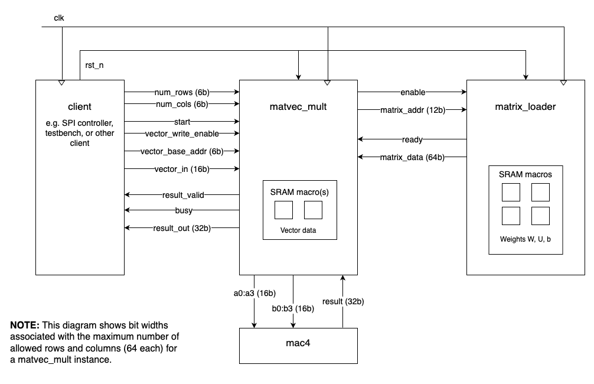

# LSTM Autoencoder Hardware Acceleration Project Report

**Niklas Anderson**  
**Spring 2025**  

**NOTE: This document is in-progress. Main sections have been outlined below, with basic lists of intended contents.**

## Overview

In this project, a custom hardware accelerator was created for a Long Short-Term Memory (LSTM) autoencoder algorithm used for identifying anomalies in weather data. Software-hardware co-design principles were applied to identify bottlenecks in the algorithm and an appropriate software/hardware boundary. Multiple iterations of a hardware design were created using SystemVerilog (SV), and synthesis was performed using OpenLane2 in order to assess viability of the design as a chiplet in terms of metrics such as power usage, design footprint, and speedup achieved over software-only execution of the algorithm.

A proof-of-concept design was successfully synthesized in iteration two, with some shortcomings which are elaborated on below. Despite synthesis challenges, the design showed a likelihood of achieving a speedup over the software-only execution, and showed the characteristics of relatively low power usage and chip size, which were two important metrics given the intended usage of this chiplet in resource-constrained environments.

  
_**Figure 1**: Block diagram of accelerator. Shows intended usage of SRAM macros, which have not yet been successfully included in synthesized module._

A secondary goal in this project was to leverage LLM support in creating programs through "vibe coding", and to use LLMs to gain a better understanding of concepts related to hardware for Artificial Intelligence (AI) and Machine Learning (ML). As such, nearly all of the code produced was done so with at least some level of support from an LLM. All of this code, beyond the most trivial of examples, also required at least some modifications and corrections, as there was no code from an LLM that could be used successfully "as is". LLM transcripts are included in individual directories alongside the related code.

## Quickstart

Primary languages used for this project included SystemVerilog (SV) and Python 3.12. Individual directories with code relying on Python, such as the [Challenge 9](./challenge-09/) directory containing the LSTM autoencoder inference script, contain a `.python-version` file indicating the specific version of Python required and a `requirements.txt` file indicating any required dependencies. Commands for individual scripts are provided within those directories' README.md files.

For managing Python versions, usage of [`pyenv`](https://github.com/pyenv/pyenv) is recommended. The following command sequence will create and activate a virtual environment, then install required dependencies:
```sh
$ python -m venv <environment name>
$ source <environment name>/bin/activate
$ pip install -r requirements.txt
```

For simulating SV code, software such as [Questa](https://www.intel.com/content/www/us/en/software/programmable/quartus-prime/questa-edition.html) or [Verilator](https://www.veripool.org/verilator/) is recommended.

Additional tools used include:
- **[OpenLane2](https://openlane2.readthedocs.io/en/latest/getting_started/newcomers/index.html)**: Toolchain containing many additional executables for performing synthesis and other operations required to prepare a design for ASIC creation. The nix-shell installation option was used in this project.
- **[sv2v](https://github.com/zachjs/sv2v)**: Used to convert SV to Verilog, which was required for usage with OpenLane2.


## Initial Implementation

The work for the first iteration of the hardware accelerator was performed in association with a number of weekly challenges. In the first associated challenge, an LSTM autoencoder model was created with assistance from ChatGPT. A training script using weather data from NOAA was created, which resulted in saved weights and scaler .npz files that were used later in an inference script.

Profiling tools such as `snakeviz` and `kernprof` were used to identify performance bottlenecks in the inference script ([`lstm_inference.py`](./challenge-09/lstm_inference.py)). This script and its associated functionality in [`lstm_core.py`](./challenge-09/lstm_core.py) were intentionally created to perform calculations in Python rather than allowing delegation to C/C++. This was done so that profiling could examine execution in-depth, allowing for better understanding of performance bottlenecks.

An initial software/hardware boundary of the `step` method on the `LSTMCell` class was chosen based on the number of calls made and cumulative execution time. The matrix-vector multiplication called multiple times within this method was another candidate. The decision to target the `step` function was based in part on the plan to store the model weights in SRAM, and to try to perform as much work as possible in hardware for the same data transfer and storage cost.

An SV implementation was created, with attempts to perform functional verification relying on the generation of weights and golden vector files to be used in the SV testbench. The generation of these files proved more challenging than expected, as an understanding of the underlying structure of the weights required more domain-specific knowledge than the "vibe coding" approach engendered. Because of the challenges in this process, synthesis work was started in parallel in order to check for any major design issues prior to completing functional verification. This proved to be an apt approach, as fundamental issues with the design in the context of synthesis were indeed discovered. The most obvious problem with the design was the very wide data buses resulting from usage of 32-bit values and support for vectors and matrices with a maximum dimension of 64, derived from the maximum hidden size for an LSTM layer.

Despite the issues and challenges described above, work on the first iteration informed significant changes in the next iteration, and highlighted areas where a deeper understanding were needed in order to create an informed design with a higher likelihood of meeting performance criteria for success. Most notably, a precise understanding of the sizing and composition of the weights for each LSTM layer was necessary for designing an implementation around the maximum bounds of data used in the matrix-vector multiplication operations.

### Additional Detail

More details are available in each of the challenges' individual directories:  
**Challenges 9 and 12: Bootstrapping the Main Project and SW / HW Boundary**  
Includes training an LSTM Autoencoder model and creation of a pure-Python inference script (Challenge 9) and profiling and analysis of script to determine software / hardware boundary and target execution time for hardware acceleration (Challenge 12). ([link](./challenge-09/README.md))

**Challenge 15: RTL Implementation of Main Project**  
Creation of SystemVerilog modules corresponding to initial hardware chosen for implementation based on the SW / HW boundary determined in Challenges 9 and 12. ([link](./challenge-15/README.md))

**Challenge 18: Going to the Transistor Level Using OpenLane2**  
Initial attempt to generate a physical transistor configuration from the HDL main project SystemVerilog code. ([link](./challenge-18/README.md))

## Version 0.2.0

Work for the second iteration of the hardware accelerator began with a [checkpoint document](./challenge-23/README.md), which summarized project status, listed changes and possible next steps, elaborated on technical details, and stated a concrete plan for iteration two implementation. This document was informed by exploration of the issues discovered through work on the first iteration, including issues in both the implementation itself as well as the gaps in understanding which allowed implementation design flaws to manifest. Specifically, it became clear that a thorough accounting of the sizing and composition of the weights was required. In addition, a better understanding of requirements for synthesis that were not immediately apparent in simulation was necessary, due to limitations in the researcher's prior experience with synthesis.

The checkpoint document plans for iteration two consisted primarily of the following:
- Adjust software/hardware boundary to the lower level of the matrix-vector multiplication instead of the LSTM Cell `step` method, in order to simplify the design while still targeting the primary computational bottleneck. This would provide a smaller module which could later be used to build up to the `step` method, if desired.
- Determine appropriate fixed-point formats for vector and matrix data in order to reduce data width to a 16-bit format. This would help resolve issues with very large data bus widths.
- With an understanding of the maximum bounds of matrix and vector dimensions, implement a time-multiplexed version of the matrix-vector multiplication module. This would entail creating loading logic so that vector data could be streamed in by the client, and the resulting vector would be streamed out by the accelerator. The iteration one module was not as intentional in its design in this regard, related to it being driven by a "vibe coding" approach.
- Perform functional verification using dummy weights rather than immediately attempting to use real weight values and a golden vector. This would simplify testing and allow for verification that was independent of the logic required for generation of weight and golden vector files.
- Attempt OpenLane2 synthesis and recalculate target execution time. This would allow an intial sense of whether the new software/hardware boundary allowed for sufficient performance improvement.

### SV Implementation

After determining appropriate fixed-point formats (see [reduced precision values overview](./lstm_autoencoder-v0.2.0/README.md#reduced-precision-values) for more detail), work was started on a second iteration SV implementation. In this iteration, significant time was spent developing and testing the vector and matrix loading logic. This was done in order to limit the maximum amount of data transferred in a single transaction in an effort to reduce maximum data bus widths. The intended data flow involved allowing a client to stream in vector data, having the matrix-vector module load matrix data from SRAM, then perform multiply-accumulate (MAC) operations on the values and stream out one resulting vector value at a time. The FSM logic was built to accommodate the varying sizes of input vectors and weight matrices used in the LSTM autoencoder inference algorithm, with a maximum dimension of 64. To support the required functionality, the modules `matvec_mult`, `mac4`, and `matrix_loader` were created, along with `matvec_tb` and `mac4_tb` testbenches.

Functional verification was completed for varying vector and matrix sizes with dummy weights prior to attempts to integrate an SRAM macro for storing weights. With a passing testbench, multiple changes were then made to support conditions for successful synthesis. This mainly involved flattening arrays to avoid 2D arrays that could be problematic in synthesis and addressing any simulation warnings such as ambiguous wire declarations for signals. Re-verification was performed with individual changes to ensure there were no functional regressions.

Expansion of the testbench to use actual weight values and golden vectors would be a desired improvement to ensure robust functionality in line with actual performance requirements.

### Synthesis

Once the design was optimized for synthesis and SRAM macros were integrated into the `matrix_loader` module, OpenLane2 synthesis was attempted. Configuration challenges were encountered and ultimately not resolved for the SRAM macros. However, configuration was created for synthesis at different levels, including just the `matvec_mult` module and its `mac4` instance. Multiple rounds of synthsis were attempted, with fixes and changes completed to address issues as they arose. As above, re-verification was performed in between these iterations in order to prevent unintended functional regressions.

Prior to completion of synthesis for the `matvec_mult` module, synthesis was performed on the `mac4` module by itself, which resulted in a maximum clock period of 40ns, or a frequency of 25MHz. This was ultimately the same maximum clock period found for a modified version of the `matvec_mult` module with a maximum vector size of 16, which completed synthesis successfully. Initial attempts with maximum sizes of 64 and 32 were unsuccessful. After analysis performed with assistance from ChatGPT, it seemed probable that the primary issue was not a fundamental design problem but more likely the fact that vectors of sizes greater than 16 needed to be stored in SRAM. As noted above, integration of SRAM macros was unsuccessful, so for the purposes of this analysis, the assumption was made that usage of SRAM would allow for synthesis-compatible storage of vectors up to a length of 64. This should be confirmed as early as possible in next steps, as the usage of SRAM is seen as a fundamental requirement for real-world usage of the designed chiplet.

As noted above, the maximum frequency of 25MHz for the `matvec_mult` module was the same as that for the `mac4` module it instantiates. Additional investigation should be done in order to determine whether the `mac4` module then is the bottleneck for the `matvec_mult` module as a whole. This would require deeper understanding of invdividual tools within the OpenLane2 toolchain. Investigation of the synthesized design was attempted, but a lack of documentation and a poor understanding of OpenLane2 on the part of ChatGPT hindered these efforts.

### Additional Detail

More details are available in the project checkpoint document and the directory containing all relevant code for iteration two:  
**Challenge 23: Week 7 Project Checkpoint**  
An overview of project status and challenges as of week 7. Includes a list of next steps for iterating on the current design. ([link](./challenge-23/README.md))

**LSTM Autoencoder Hardware Accelerator Version 0.2.0**  
The second iteration of a hardware accelerator for the LSTM autoencoder inference algorithm created in Challenge 9 as a part of the main course project. This version implements matrix-vector multiplication in hardware and was successful in serving as a proof-of-concept for a synthesizable module meeting the execution timing requirements. ([link](./lstm_autoencoder-v0.2.0/README.md))

## Design Decisions

- Time-multiplexed over systolic array - optimizing for reduced size and power consumption over execution time
- Work to tailor the hardware for the specific weights and input vector values - created scripts to find the max and min values and used fixed point formats based on these values
- Weight-stationary in SRAM - very important for reducing communication cost, but a significant barrier in synthesis. Will be further discussed later.

## Results & Discussion

- Based on estimates (reference work from challenge 12), the proof-of-concept v0.2.0 would meet the threshhold for providing a speedup
  - Reference simulation results showing number of clock cycles as well
- Analysis of metrics.json indicates this design successfully prioritized relatively low power consumption and a small footprint, in alignment with initial goals for deployment in a remote environment, over execution speed
  - Ideal comparison would be to the CPU execution, might try to look into making that determination
  - As mentioned in the v0.2.0 README, the analysis was not performed on a synthesized module using SRAM macros. With SRAM macros successfully integrated into the design, the power, die area, and number of transistors will inevitably increase. This may make it more important to adjust the software/hardware boundary again to make better use of the fact that the weights are stored in SRAM by including more functionality in hardware.
- Challenges, especially related to limited domain expertise in initial model creation
  - Naive LLM-driven implementation allowed for relatively quick iteration, but at the cost of making mistakes that likely could have been avoided with better conceptual understanding of the model beforehand. A deeper understanding was ultimately gained, but note the tradeoffs.

## Future Work

### SRAM
- Find or build an SRAM macro that works with openlane2, or find another synthesis toolchain that has usable SRAM macros
- Move vector data to SRAM macro as well as weights
- Add loading logic for matrix data to matvec_mul, in order to reduce bit width of matrix_data
- Reference list in lstm_autoencoder-v0.2.0 README for details on SRAM memory layout and FSM

### Added Parallelization
- Adjusting the software/hardware boundary to leverage possible parallelism at the gate level (i.e. 4 gates f, i, o, c may compute values in parallel based on `step` function)
  - This amortizes the power and footprint costs associated with the SRAM usage for the weights by providing more operations performed in hardware with the same data transfer cost
- Multiple MAC4 instances

### MAC4 Improvements
- Make MAC4 into sequential pipelined logic to avoid long critical path in combinational version
  - Is this module the bottleneck? How to determine?

### Improved Testing
- cocotb testing with simulated SPI bus to verify timing estimates
