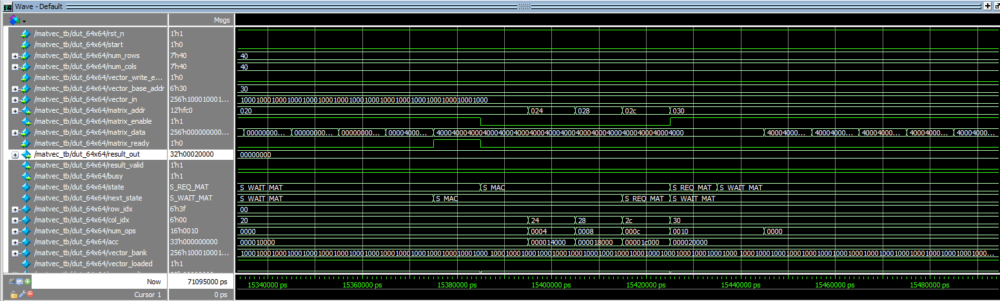
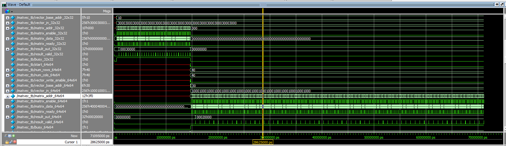
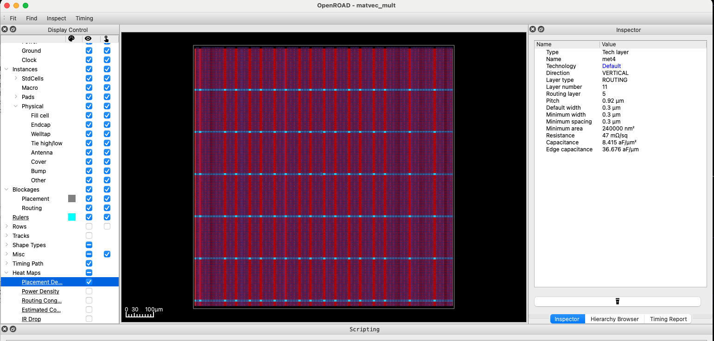

# LSTM Autoencoder Hardware Acceleration Project Report

**Niklas Anderson**  
**Spring 2025**  

## Overview

In this project, a custom hardware accelerator was created for a Long Short-Term Memory (LSTM) autoencoder algorithm used for identifying anomalies in weather data. Software-hardware co-design principles were applied to identify bottlenecks in the algorithm and an appropriate software/hardware boundary. Multiple iterations of a hardware design were created using SystemVerilog (SV), and synthesis was performed using OpenLane2 in order to assess viability of the design as a chiplet in terms of metrics such as power usage, design footprint, and speedup achieved over software-only execution of the algorithm.

A proof-of-concept design was successfully synthesized in iteration two, with some shortcomings which are elaborated on below. Despite synthesis challenges, the design showed a likelihood of achieving a speedup over the software-only execution, and showed the characteristics of relatively low power usage and chip size, which were two important metrics given the intended usage of this chiplet in resource-constrained environments.

  
_**Figure 1**: Block diagram of accelerator. Shows intended usage of SRAM macros, which have not yet been successfully included in synthesized module._

A secondary goal in this project was to leverage LLM support in creating programs through "vibe coding", and to use LLMs to gain a better understanding of concepts related to hardware for Artificial Intelligence (AI) and Machine Learning (ML). As such, nearly all of the code produced was done so with at least some level of support from an LLM. All of this code, beyond the most trivial of examples, also required at least some modifications and corrections, as there was no code from an LLM that could be used successfully "as is". LLM transcripts are included in individual directories alongside the related code.

## Quickstart

Primary languages used for this project included SystemVerilog (SV) and Python 3.12. Individual directories with code relying on Python, such as the [Challenge 9](./challenge-09/) directory containing the LSTM autoencoder inference script, contain a `.python-version` file indicating the specific version of Python required and a `requirements.txt` file indicating any required dependencies. Commands for individual scripts are provided within those directories' README.md files.

For managing Python versions, usage of [`pyenv`](https://github.com/pyenv/pyenv) is recommended. The following command sequence will create and activate a virtual environment, then install required dependencies:
```sh
$ python -m venv <environment name>
$ source <environment name>/bin/activate
$ pip install -r requirements.txt
```

For simulating SV code, software such as [Questa](https://www.intel.com/content/www/us/en/software/programmable/quartus-prime/questa-edition.html) or [Verilator](https://www.veripool.org/verilator/) is recommended.

Additional tools used include:
- **[OpenLane2](https://openlane2.readthedocs.io/en/latest/getting_started/newcomers/index.html)**: Toolchain containing many additional executables for performing synthesis and other operations required to prepare a design for ASIC creation. The nix-shell installation option was used in this project.
- **[sv2v](https://github.com/zachjs/sv2v)**: Used to convert SV to Verilog, which was required for usage with OpenLane2.


## Initial Implementation

The work for the first iteration of the hardware accelerator was performed in association with a number of weekly challenges. In the first associated challenge, an LSTM autoencoder model was created with assistance from ChatGPT. A training script using weather data from NOAA was created, which resulted in saved weights and scaler .npz files that were used later in an inference script.

Profiling tools such as `snakeviz` and `kernprof` were used to identify performance bottlenecks in the inference script ([`lstm_inference.py`](./challenge-09/lstm_inference.py)). This script and its associated functionality in [`lstm_core.py`](./challenge-09/lstm_core.py) were intentionally created to perform calculations in Python rather than allowing delegation to C/C++. This was done so that profiling could examine execution in-depth, allowing for better understanding of performance bottlenecks.

An initial software/hardware boundary of the `step` method on the `LSTMCell` class was chosen based on the number of calls made and cumulative execution time. The matrix-vector multiplication called multiple times within this method was another candidate. The decision to target the `step` function was based in part on the plan to store the model weights in SRAM, and to try to perform as much work as possible in hardware for the same data transfer and storage cost.

An SV implementation was created, with attempts to perform functional verification relying on the generation of weights and golden vector files to be used in the SV testbench. The generation of these files proved more challenging than expected, as an understanding of the underlying structure of the weights required more domain-specific knowledge than the "vibe coding" approach engendered. Because of the challenges in this process, synthesis work was started in parallel in order to check for any major design issues prior to completing functional verification. This proved to be an apt approach, as fundamental issues with the design in the context of synthesis were indeed discovered. The most obvious problem with the design was the very wide data buses resulting from usage of 32-bit values and support for vectors and matrices with a maximum dimension of 64, derived from the maximum hidden size for an LSTM layer.

Despite the issues and challenges described above, work on the first iteration informed significant changes in the next iteration, and highlighted areas where a deeper understanding were needed in order to create an informed design with a higher likelihood of meeting performance criteria for success. Most notably, a precise understanding of the sizing and composition of the weights for each LSTM layer was necessary for designing an implementation around the maximum bounds of data used in the matrix-vector multiplication operations.

### Additional Detail

More details are available in each of the challenges' individual directories:  
**Challenges 9 and 12: Bootstrapping the Main Project and SW / HW Boundary**  
Includes training an LSTM Autoencoder model and creation of a pure-Python inference script (Challenge 9) and profiling and analysis of script to determine software / hardware boundary and target execution time for hardware acceleration (Challenge 12). ([link](./challenge-09/README.md))

**Challenge 15: RTL Implementation of Main Project**  
Creation of SystemVerilog modules corresponding to initial hardware chosen for implementation based on the SW / HW boundary determined in Challenges 9 and 12. ([link](./challenge-15/README.md))

**Challenge 18: Going to the Transistor Level Using OpenLane2**  
Initial attempt to generate a physical transistor configuration from the HDL main project SystemVerilog code. ([link](./challenge-18/README.md))

## Version 0.2.0

Work for the second iteration of the hardware accelerator began with a [checkpoint document](./challenge-23/README.md), which summarized project status, listed changes and possible next steps, elaborated on technical details, and stated a concrete plan for iteration two implementation. This document was informed by exploration of the issues discovered through work on the first iteration, including issues in both the implementation itself as well as the gaps in understanding which allowed implementation design flaws to manifest. Specifically, it became clear that a thorough accounting of the sizing and composition of the weights was required. In addition, a better understanding of requirements for synthesis that were not immediately apparent in simulation was necessary, due to limitations in the researcher's prior experience with synthesis.

The checkpoint document plans for iteration two consisted primarily of the following:
- Adjust software/hardware boundary to the lower level of the matrix-vector multiplication instead of the LSTM Cell `step` method, in order to simplify the design while still targeting the primary computational bottleneck. This would provide a smaller module which could later be used to build up to the `step` method, if desired.
- Determine appropriate fixed-point formats for vector and matrix data in order to reduce data width to a 16-bit format. This would help resolve issues with very large data bus widths.
- With an understanding of the maximum bounds of matrix and vector dimensions, implement a time-multiplexed version of the matrix-vector multiplication module. This would entail creating loading logic so that vector data could be streamed in by the client, and the resulting vector would be streamed out by the accelerator. The iteration one module was not as intentional in its design in this regard, related to it being driven by a "vibe coding" approach.
- Perform functional verification using dummy weights rather than immediately attempting to use real weight values and a golden vector. This would simplify testing and allow for verification that was independent of the logic required for generation of weight and golden vector files.
- Attempt OpenLane2 synthesis and recalculate target execution time. This would allow an intial sense of whether the new software/hardware boundary allowed for sufficient performance improvement.

### SV Implementation

After determining appropriate fixed-point formats (see [reduced precision values overview](./lstm_autoencoder-v0.2.0/README.md#reduced-precision-values) for more detail), work was started on a second iteration SV implementation. In this iteration, significant time was spent developing and testing the vector and matrix loading logic. This was done in order to limit the maximum amount of data transferred in a single transaction in an effort to reduce maximum data bus widths. The intended data flow involved allowing a client to stream in vector data, having the matrix-vector module load matrix data from SRAM, then perform multiply-accumulate (MAC) operations on the values and stream out one resulting vector value at a time. The FSM logic was built to accommodate the varying sizes of input vectors and weight matrices used in the LSTM autoencoder inference algorithm, with a maximum dimension of 64. To support the required functionality, the modules `matvec_mult`, `mac4`, and `matrix_loader` were created, along with `matvec_tb` and `mac4_tb` testbenches.

Functional verification was completed for varying vector and matrix sizes with dummy weights prior to attempts to integrate an SRAM macro for storing weights. A [transcript of results](./lstm_autoencoder-v0.2.0/docs/simulation-transcript.txt) shows passing results and calculated number of clock cycles for different sizes. With a passing testbench, multiple changes were then made to support conditions for successful synthesis. This mainly involved flattening arrays to avoid 2D arrays that could be problematic in synthesis and addressing any simulation warnings such as ambiguous wire declarations for signals. Re-verification was performed with individual changes to ensure there were no functional regressions.

Expansion of the testbench to use actual weight values and golden vectors would be a desired improvement to ensure robust functionality in line with actual performance requirements.

  
*Simulation in Questa showing the FSM in a MAC operation for a 64x64 matrix.*

  
*Simulation in Questa showing the complete testbench with 4x4, 32x32, and 64x64 matrix dimensions. Note, the unknown values on some signals are expected in this context.*

### Synthesis

Once the design was optimized for synthesis and SRAM macros were integrated into the `matrix_loader` module, OpenLane2 synthesis was attempted. Configuration challenges were encountered and ultimately not resolved for the SRAM macros. However, configuration was created for synthesis at different levels, including just the `matvec_mult` module and its `mac4` instance. Multiple rounds of synthsis were attempted, with fixes and changes completed to address issues as they arose. As above, re-verification was performed in between these iterations in order to prevent unintended functional regressions.

Prior to completion of synthesis for the `matvec_mult` module, synthesis was performed on the `mac4` module by itself, which resulted in a maximum clock period of 40ns, or a frequency of 25MHz. This was ultimately the same maximum clock period found for a modified version of the `matvec_mult` module with a maximum vector size of 16, which completed synthesis successfully. Initial attempts with maximum sizes of 64 and 32 were unsuccessful. After analysis performed with assistance from ChatGPT, it seemed probable that the primary issue was not a fundamental design problem but more likely the fact that vectors of sizes greater than 16 needed to be stored in SRAM. As noted above, integration of SRAM macros was unsuccessful, so for the purposes of this analysis, the assumption was made that usage of SRAM would allow for synthesis-compatible storage of vectors up to a length of 64. This should be confirmed as early as possible in next steps, as the usage of SRAM is seen as a fundamental requirement for real-world usage of the designed chiplet.

As noted above, the maximum frequency of 25MHz for the `matvec_mult` module was the same as that for the `mac4` module it instantiates. Additional investigation should be done in order to determine whether the `mac4` module then is the bottleneck for the `matvec_mult` module as a whole. This would require deeper understanding of invdividual tools within the OpenLane2 toolchain. Investigation of the synthesized design was attempted, but a lack of documentation and a poor understanding of OpenLane2 on the part of ChatGPT hindered these efforts.

  
*Openroad GUI showing placement density of successfully synthesized design.*

  
*Openroad GUI showing power density of successfully synthesized design.*

### Additional Detail

More details are available in the project checkpoint document and the directory containing all relevant code for iteration two:  
**Challenge 23: Week 7 Project Checkpoint**  
An overview of project status and challenges as of week 7. Includes a list of next steps for iterating on the current design. ([link](./challenge-23/README.md))

**LSTM Autoencoder Hardware Accelerator Version 0.2.0**  
The second iteration of a hardware accelerator for the LSTM autoencoder inference algorithm created in Challenge 9 as a part of the main course project. This version implements matrix-vector multiplication in hardware and was successful in serving as a proof-of-concept for a synthesizable module meeting the execution timing requirements. ([link](./lstm_autoencoder-v0.2.0/README.md))

## Design Decisions

### Matrix-Vector Multiplication Architecture

A time-multiplexed architecture was chosen over the commonly-used systolic array approach. This was informed by the initial project goals to deploy this chiplet in resource-constrained environments and prioritize reducing power usage and chiplet footprint over execution time improvements. In exploration of architecture options with ChatGPT, it was also suggested that a systolic array would be a better choice if matrix-matrix multiplication was intended as a future improvement. Since this was not the case, and the algorithm required only matrix-vector multiplication, this was seen as further indication that a time-multiplexed approach was more appropriate than a systolic array.

### Fixed Point Formats

As referenced above, in planning for iteration two, deep exploration was done in order to gain a better understanding of the weights used by the model targeted for hardware acceleration. This involved creating scripts to find minimum and maximum values for weights and understand the parameters around vector values. This exploration was used to determine the specific 16-bit fixed point formats used. The format of Q4.12 was determined to be a good fit for vector values given the anticipated maximum and minimum values, and a format of Q2.12 was chosen for weights given their identified maximum and minimum values. These formats were then used in the `mac4` and `matvec_mult` modules. These provided a very targeted approach to allow for the greater precision available that would balanced the overall reduced precision from going down to 16 bits from 32 bits.

This background discovery work would also support any future changes to reduce precision further, down to 8 bits from 16.

### Weight-Stationary Design Using SRAM

One of the most impactful design decisions made early-on was to use a weight-stationary approach by storing the model weights in SRAM. This was chosen as an obvious design goal given the reduction in data transfer it would provide. The LSTM autoencoder model has a large weight requirement, due to both the particulars of this model and its inference script with the 4 layers and their maximum hidden size of 64, along with the general requirements of LSTM models and their 4 gates (input: `i`, forget: `f`, cell: `c`, and output: `o`), within each layer.

Despite the problems encountered using the openly-available SRAM macros, this design decision is still considered a fundamental requirement of this chiplet implementation. In addition to the benefit of sizable data transfer reduction, this approach also allows for adjusting the software/hardware boundary in such a way that the cost of storing the weights in SRAM may be amortized if the hardware responsibilities are increased. As such, next steps should be to investigate alternative toolchains or SRAM macros in order to find a workable option, rather than attempt to re-work the implementation to include transfer of weights as a part of each matrix-vector calculation.

## Results & Discussion

### Hardware Accelerator Performance

To assess the ultimate performance success of the hardware acclerator implementation, a target execution time was calculated for each iteration. More details are visible in documentation for [Challenge 12](./challenge-09/README.md#challenge-12-hardware-acceleration), but to summarize, the proof-of-concept v0.2.0 implementation (iteration two) did appear to meet the target execution time requirements. This version also appeared to meet other desired performance characteristics such as relatively low power consumption and overall footprint. This conclusion comes with some caveats, however. The successful synthesis of the `matvec_mult` module had a reduced maximum vector input size of 16 rather than 64, as described above. This synthesis also did not include any SRAM macros. It should be assumed then, that the power requirements and footprint would be larger than the synthesis metrics described, once SRAM macros are successfully integrated. It is also assumed that usage of SRAM macros would allow for the increase in size back up to 64 as the orginal design intended, once the input vector could be buffered in SRAM. More details on interpretation of the synthesis results are found in the [lstm_autoencoder-v0.2.0 README](./lstm_autoencoder-v0.2.0/README.md#interpreting-synthesis-results). In short, the maximum clock cycles required for a pessimistic assumption of all matrix-vector multiplication operations using the maximum size of 64 was calculated to be 5885 cycles with a 40ns clock period, while simulation showed a 64x64 matrix-vector multiplication operation required 4223 cycles (seen in the [simulation-transcript](./lstm_autoencoder-v0.2.0/docs/simulation-transcript.txt)). This is not a great speedup, but given that the estimate was pessimistic and that the priorities were reduced size and power consumption, this seems like a reasonably successful result.

Further work is clearly necessary to prove the execution time, power usage, and footprint characteristics are maintained sufficiently to indicate success in providing an overall benefit once SRAM is incorporated. Additional comparisons of power usage against the default software-only execution on the CPU would help strengthen the case that the chiplet provides a net improvement.

It may be the case that again adjusting the software/hardware boundary would be necessary to justify the increased die area and power consumption that would result from SRAM usage. This would allow for amortization of the SRAM usage cost by providing more algorithm calculation coverage in hardware over software.

### LLM Usage

Overall, the LLM support on this project was likely a net benefit which allowed more work to be done on a faster timeline. However, there were some notable drawbacks. Though LLM usage supported quick creation of an LSTM autoencoder model trained on real-world data, it did not enforce the kind of domain expertise that would previously have been required in order to create such a model. The benefit here is clear, in that a model may be created without an extended learning period on behalf of the researcher, but the drawbacks became apparent when issues were uncovered that required a deeper understanding of the model, and in particular of the weights. Ultimately, that requirement of deeper understanding was a limiting factor in quality of implementation. Prior to engaging in a properly informed design discussion for iteration two, a thorough investigation of the model and the size and shape of the weights was necessary.

An additional issue with weight usage was uncovered through the aforementioned investigation. It was determined that the inference script created with LLM assistance did not properly transpose the weights, meaning that the initial benchmarking of the algorithm was inaccurate. Fortunately, it was a matter of overall execution time rather than specific functional differences, or more succinctly, quantity rather than quality, so the core assumptions informing software/hardware boundary decisions were still sound. However, the execution time difference was objectively massive, making the final target execution time much different.

The issues described above may be seen as the cost of the fast iteration that LLM assistance supports. In addition, the LLM assistance utilized in this project provided for fast iteration not just within the different project stages, but *across the project as a whole*. This provided an improved big-picture understanding of the requirements at each individual stage, as the manner in which the stages fit together came into focus. There were a few instances where parallelizing work on synthesis with functional verification, for example, beneficially cut short unnecessary work on verification when it became apparent that fundamental design flaws for synthesis existed.

Overall, work with LLM assistance benefits from new approaches, where identifying essential gaps in domain expertise as early as possible is helpful in avoiding poorly-formed initial implementations. Speed of iteration should be balanced with slow, deep investigation into domain-specific requirements where necessary.

## Future Work

### SRAM

As noted above, integration of SRAM is seen as an essential next step. The following related work should be done:
- Find or build an SRAM macro that works with openlane2, or find another synthesis toolchain that has usable SRAM macros
- In addition to storing weights in SRAM, move the vector data buffer to SRAM macro
- Add loading logic for matrix data to `matvec_mult`, similar to loading logic for vector data, in order to reduce the sizable maximum bit width of the `matrix_data` signal. (See diagram above.)
- Consider overall SRAM memory layout once the proof-of-concept work is expanded for usage with all weights and gates. Details and suggestions are found in the [lstm_autoencoder-v0.2.0 README](./lstm_autoencoder-v0.2.0/README.md#sram-addressing).

### Added Parallelization

- Adjust the software/hardware boundary to leverage possible parallelism at the gate level (i.e. the 4 gates `f`, `i`, `o`, and `c` may compute values in parallel within the `step` function).
  - This amortizes the power and footprint costs associated with the SRAM usage for the weights by providing more operations performed in hardware with the same data transfer cost.
- Use multiple MAC4 instances within `matvec_mult`. This could double the speed of calculation, but will require adjustments to the accumulation FSM logic.

### MAC4 Improvements

- Make MAC4 into sequential pipelined logic to avoid long critical path in combinational version. This should be prioritized after determined whether this is the computation bottleneck in the hardware, as is suggested by the maximum clock frequency seen in the final metrics from running openlane.

### Improved Testing
- `cocotb` testing with a simulated SPI bus to verify timing estimates should be added.
