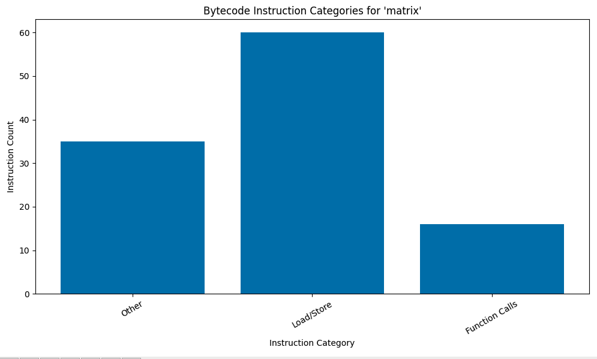
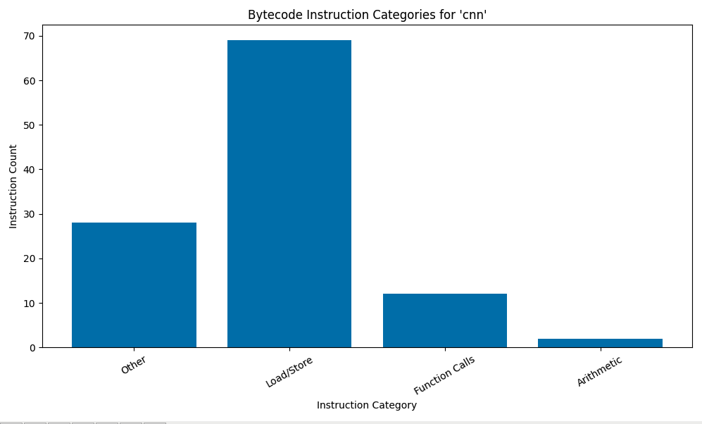
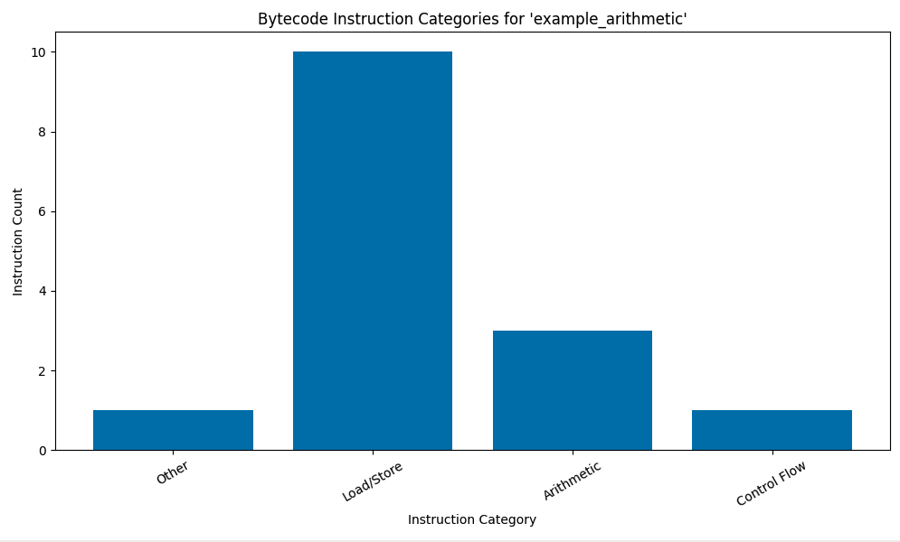
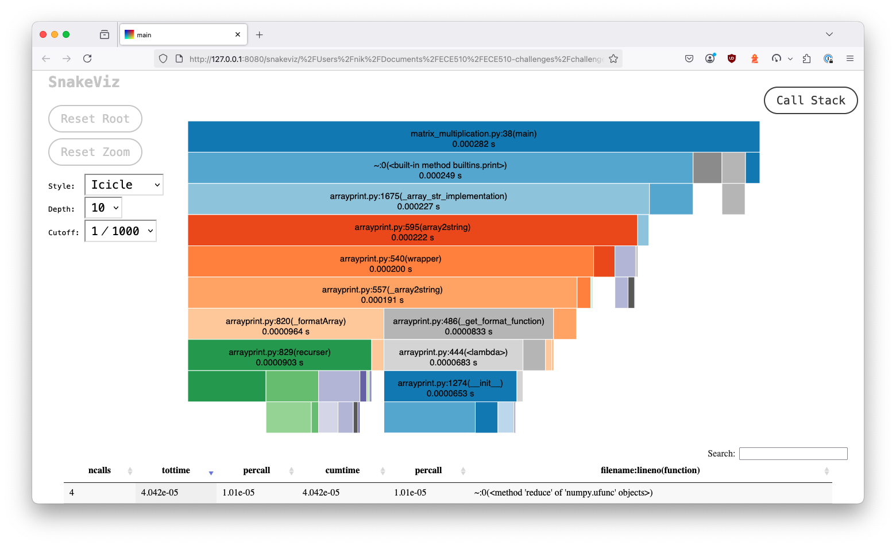
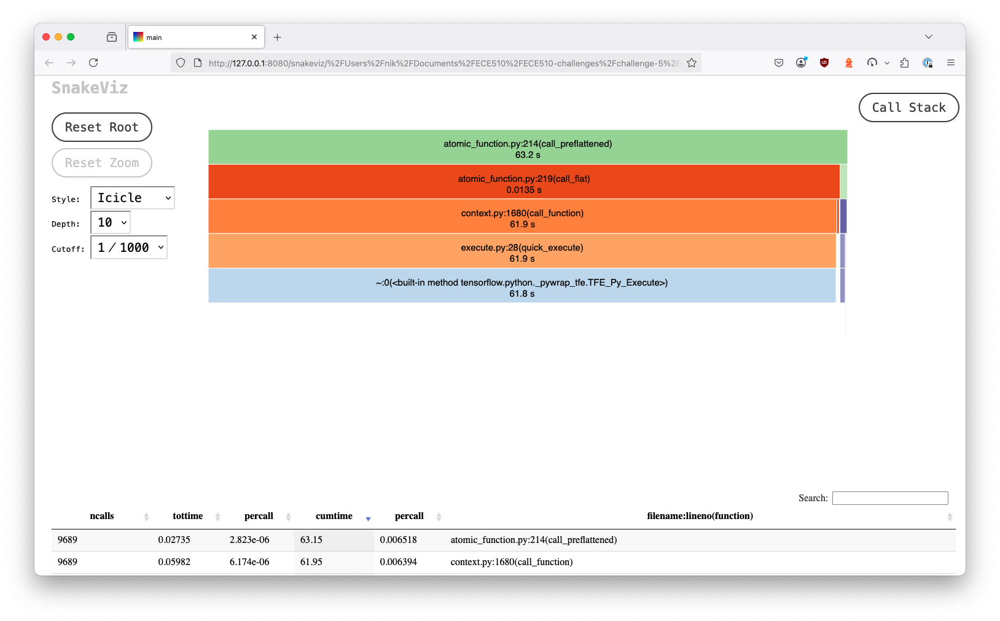

# Python Bytecode Analysis

Challenge 5 from [w1_codefest.pdf](./w1_codefest.pdf), involving bytecode analysis of various Python programs with the goal of identifying parallelism or other opportunities for optimizations through alternate hardware or instruction set usage.

Python programs for matrix multiplication, differential equation calculation, quicksort, cryptography, and a convolutional neural network were generated using a "vibe coding" approach, first with Gemini, then ChatGPT. A `main` program was also created to support analysis of the generated algorithms.

All program implementations were modified until they were working, at least well enough for a basic analysis. However, in performing the bytecode analysis and profiling, it became apparent that nearly all of the significant arithmetic computation in the programs was being delegated to C programs. As such, the deeper algorithmic analysis was not possible with the Python-focused profiling tools. Next steps for analysis of programs using TensorFlow tooling would be to use the TensorFlow-specific dashboard and profiling tools, or C-specific tooling for C programs.

Full LLM transcripts found in [LLM_TRANSCRIPT.md](./LLM_TRANSCRIPT.md). Commands for running example programs and program analysis are found below, following results and discussion.

## Results

### Bytecode Instruction Analysis

Generated bar charts showing instructions by category for each program showed no or very few arithmetic instructions for each program. ChatGPT suggested this was due to the programs delegating all arithmetic functionality to underlying C programs. This would make sense, but did not help with the desired algorithmic analysis.


*Bar chart of opcodes by category for matrix multiplication program, indicating that arithmetic functions are not in Python, and have likely been delegated to C code via Numpy instead.*


*Bar chart of opcodes by category for CNN program. There is a relatively small reported number of arithmetic functions here, despite this program obviously having an intensive arithmetic computation component.*


*Bar chart of opcodes by category for example program, showing that basic arithmetic functions in Python are captured when present. This was performed to confirm there was not a tooling or analysis issue.*

Though the bytecode analysis in itself did not produce deeper insights into the arithmetic workload of these programs, it is worth mentioning that there are multiple ways of generating such bytecode for analysis, with differing results. In a first attempt, disassembled code was output to individual files using `dis`. Separately,  counts for different instruction categories was produced by analysis of the `module.main.__code__` code object. This resulted in a discrepancy between the programmatic counts from the code object and the results based on inspection of the disassembly file. It seems that the code object is further optimized for the Python interpreter, and has in some cases alternative instructions related to caching. Though this does not change the more salient issue of delegation to C code, it is worth noting that not all bytecode analysis may be equal.

### Code Profiling

Similar to the above, analysis of the code using `cProfile` and interactive visualization with `snakeviz` provided support for the conclusion that the computationally intensive arithmetic work was not taking place directly in Python code, but instead in underlying libraries using C or C++.


*Visualization in `snakeviz` of matrix multiplication program shows that most of the work taking place in Python code was related to printing output instead of arithmetic functions.*


*Visualization in `snakeviz` of convolutional neural network program showing the functions with the most significant cumulative execution time. In requesting additional information on the TensorFlow function here, ChatGPT indicated that "TFE_Py_Execute is a C function exposed as a built-in method in Python".*

## Reflections on "Vibe Coding"

Though it is clearly possible to generate relatively lengthy and complex programs through "vibe coding", the process varies in its efficiency and overall quality of experience. For example, it happened more than once that the LLM was unable to determine the cause of an issue, despite being provided with all relevant code. Gemini, in particular, seemed to struggle with acknowledging that a provided unit test was in fact failing. It reached a point where it could only continue to assert that everything was correct, so it the test does not fail, despite being provided proof to the contrary. ChatGPT briefly struggled to find the problem, but did ultimately root out the issue (the problematic code was in the test setup rather than the test or function being tested).

Beyond the struggles with the LLMs' ability to see certain issues in code, it seems that neither Gemini nor ChatGPT is well-equipped or empowered to make higher-level architecture recommendations, which in some instances would be the better solution to a coding problem. For example, when implementing parts of the profiling code, it became apparent that a structural reorganization made more sense than continuing to look for localized solutions to the problem at hand. Gemini was not able or is not currently encouraged to step out of the immediate problem and view the bigger picture. Even when asked explicitly about a potential reorganization, along with a reminder of the broader program goals, the suggestions it produced were small in scale.

Though LLMs currently do not seem well-suited for bigger-picture program architecture, the immediate generation of (mostly) working programs and functionality does allow quick iteration and evaluation of alternatives. This relies on the user having some ideas in mind, or possibly engaging in a separate LLM thread in which candidate architectures are generated.

**In summary:**
- One weakness of LLMs in discovery of program errors is the occasional inability to break out of what seems to be a particular interpretation of the provided code, resulting in endless looping around incorrect solutions.
- The LLMs utilized here do not step back from the immediate problem at hand to question the general approach. In the face of increasing problems, they do not ask whether there's a better high-level approach, instead attempting to produce more and more specific solutions in a tunneling fashion.
- It may be possible to have a separate or preliminary architecture evaluation thread with an LLM as a precursor to generating and troubleshooting program code. At a minimum, the very fast production of small functions and programs allows for quick iteration through candidate architectures, which may rely on user expertise.

## Commands

The commands `run`, `analyze`, and `analyze-bytecode` may be called with any of the following shorthand program names: `od`, `cnn`, `matrix`, `qs`, or `crypt`.

Run unit tests for a program:
```sh
python main.py qs run
```

Analyze a program:
```sh
python main.py qs analyze
```

Analyze a program and start a `snakeviz` visualization in the browser:
```sh
python main.py cnn analyze --visualize
```

Generate a bar chart showing instructions by category:
```sh
python main.py qs analyze-bytecode
```

Generate an example bar chart with arithmetic instructions:
```sh
python main.py dummy test-bytecode example_arithmetic
```

May substitute `example_control_flow`, `example_function_calls`, or `example_load_store` in place of `example_arithmetic`.
