# Basic Perceptron Implementation

**Niklas Anderson**  
**April 2025**

## Overview
The following work represents Challenges 6, 7, and 8, including:
- Implementation of a simple neuron with 2 inputs and a sigmoid activation function. The neuron was trained using the perceptron learning rule, targeting NAND and XOR data sets.
- Visualization of results from the above training, including weight and bias evolution over a set number of epochs, learning curve, and decision boundary animations.
- Implementation of a multi-layer feed-forward perceptron (MLP) network. This 2-2-1 network included 2 input neurons, 2 hidden neurons, and 1 output neuron. This was trained on the XOR data set. Additional visualizations of the MLP training were created, including images targeting the role of the hidden layer in producing output via the output neuron.

Full LLM transcripts found in [LLM_TRANSCRIPT.md](./LLM_TRANSCRIPT.md). Commands for running example programs are found below.

## Simple Neuron Trained on NAND and XOR

A basic `Perceptron` class was created with the assistance of ChatGPT, whose core functionality included `train` and `forward` methods. The `train` method requires a data set and a number of epochs, then uses a `sigmoid_derivative` function to refine `weight` and `bias` values using gradient descent, with one `weight` per neuron input. A learning rate of 0.1 was used across all examples, but this value was parameterized in the `Perceptron` constructor.

After training, the model was capable of producing a prediction for a set of inputs using the `forward` method, which performed a multiply-accumulate with matrix multiplication on the weights and inputs, incorporated the `bias` value, and finally squashed the output to a value between 0 and 1 using a `sigmoid` function.

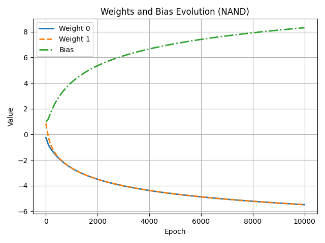  
*Chart showing progression of weights and bias values for NAND training over 10k epochs.*

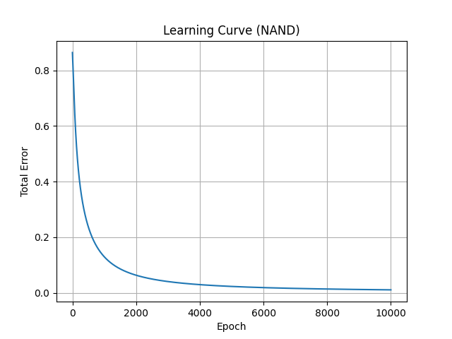  
*Chart showing learning curve for NAND training over 10k epochs. As expected, the model is successfully able to reduce the total error to nearly zero.*

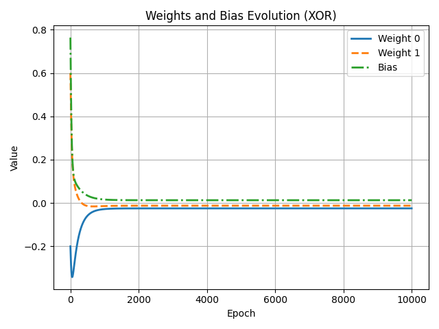  
*Chart showing progression of weights and bias values for XOR training over 10k epochs.*

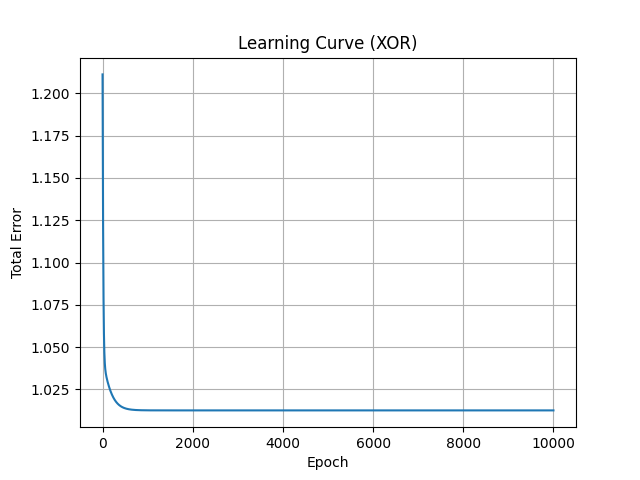  
*Chart showing learning curve for XOR training over 10k epochs. The total error the model is able to achieve levels off quickly, but is never reduced to much below 1.025. This is due to XOR not being a linearly separable problem.*

As expected, it was possible to successfully train this simple model on a NAND function, because it is a linearly separable problem. XOR was unsuccessful across multiple training runs, illustrating that it is not possible for this model to produce nonlinear separable classification. Animations showing the decision boundary for each further illustrate this point.

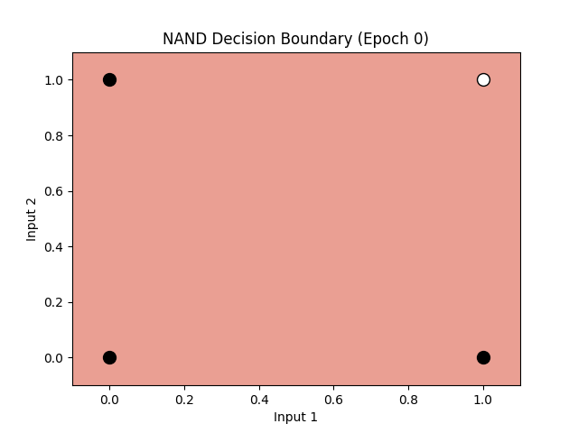  
*Decision boundary animation for NAND training over 10k epochs, showing the model correctly producing results using linear separation of the problem.*

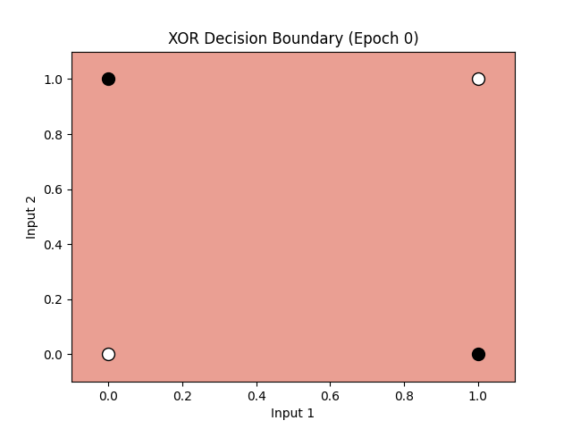  
*Decision boundary animation for XOR training over 10k epochs, showing the model attempting to find a linear separation, but ultimately producing incorrect results for the XOR function.*

The above show the decision boundary for a 2-value input space. The decision boundary is where the output function produces a value of 0.5, which is where the sigmoid transitions from 0 to 1. Each input then is represented on its own axis, with a line showing the demarcation between classifications of a set of inputs.

## Multi-layer Perceptron (MLP) Network Trained on XOR

Next, an MLP network was implemented as an `MLP` class with a similar API to the `Perceptron` class. However, the MLP required hidden weights and biases to represent the 2 neurons in the hidden layer, as well as output weights and bias. The `train` method included additional logic to perform the backpropagation and updating of weights for all neurons. The `forward` method was similar to the `Perceptron` `forward` method, but again, required additional computations to handle the expanded sets of weights and bias values.

The initial implementation provided by ChatGPT did not result in successful training on the XOR function. The `weight` and `bias` values had been hardcoded, resulting in identical training for each hidden neuron. After updating the code to use random initial values, the model typically was successfully trained on XOR with the default learning rate and epochs. The model still failed in training occasionally, but no further changes were introduced so that the incorrect training outputs could be compared for learning purposes. If it had been a desired outcome to achieve a higher likelihood of successful training, the following changes could have been considered:
- **Adjust the learning rate.** ChatGPT suggested a higher learning rate of 0.5 or even 1 may be beneficial in early stages of learning.
- **Use multiple training runs and select the best result.** This method may be referred to as "random restart", and sometimes the resulting models may be averaged.

In order to better understand the role of the neurons in the hidden layer, and how they provide the capability for addressing nonlinearly separable problems, ChatGPT was interrogated further and additional visualizations were created. The following is a brief summary of some of the main points regarding the hidden layer neurons:
- Hidden layer neurons may each contribute nonlinear functional outputs, which are then modified by the output neuron.
- Hidden layer neurons may perform feature identification, which does not necessarily correlate directly to the explicit features of the problem space, but rather features that may be combined to create the desired outcome. That is, the hidden layer neurons may not represent a direct decomposition of the problem.
- Relatedly, the hidden layers may produce intermediate representations of the problem.
- Though the hidden layer neurons may each contribute, there is no guarantee of equal or symmetrical contributions by each. It's possible for a single hidden layer neuron to provide the significant classification. The output neuron determines how to modify the contributions of each.

The following visualizations were created to support a deeper understanding of hidden layer contributions to the final model output:

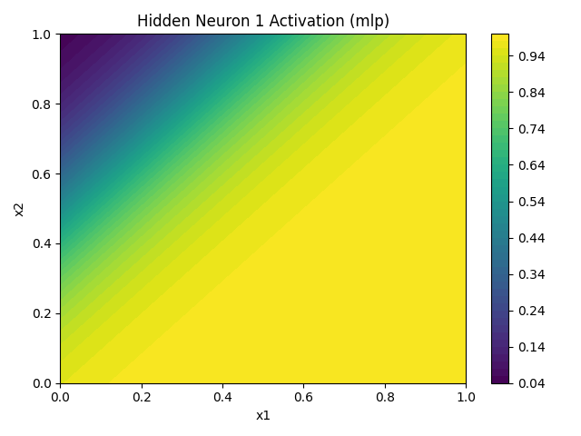  
*Activation values for hidden neuron 1 within the XOR input space.*

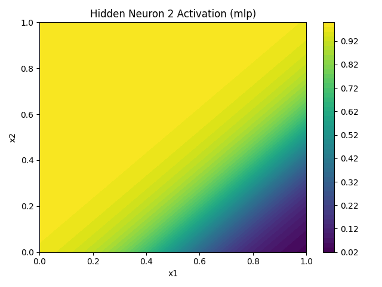.  
*Activation values for hidden neuron 2 within the XOR input space.*

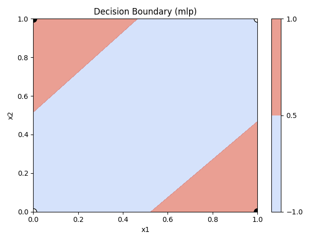  
*Decision boundary for an MLP trained on XOR data.*

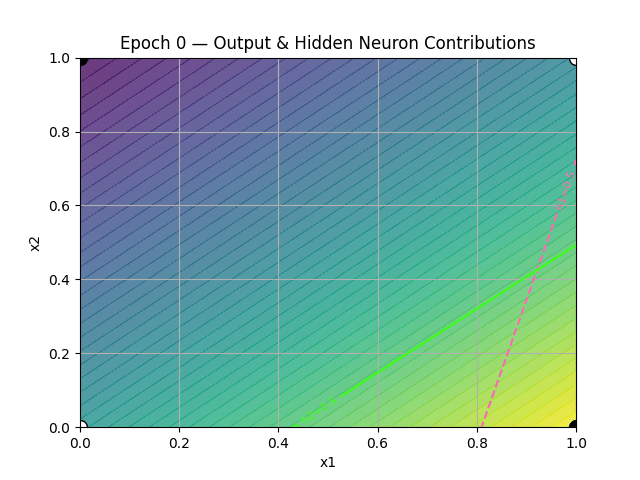.  
*Animation of output neuron output overlaid with hidden neurons threshold values for the MLP trained on XOR data. Green lines show the activation thresholds for hidden neuron 2, pink lines show the activation thresholds for hidden neuron 1. Output neuron values were produced by the function using the output weights and bias prior to being squashed by the sigmoid function. Note: Beginning frames are weighted in order to slow the animation progression during significant model changes.*

Though there is no guarantee of a strict decomposition of the problem by each hidden neuron, the above example does show a clear breakdown of each hidden neuron's contribution to the decision boundary. The below is the same set of visualizations, but for a model producing incorrect results for the XOR problem.

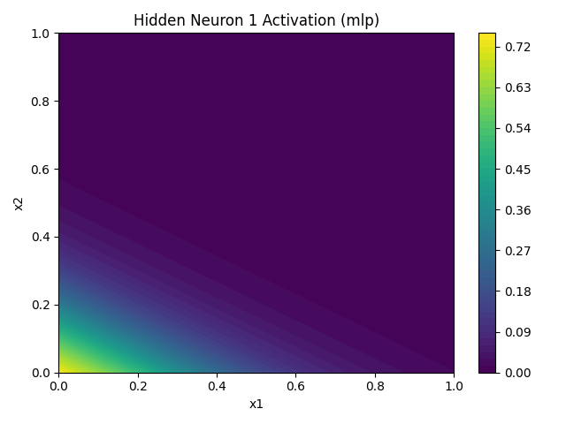  
*Activation values for hidden neuron 1 within the XOR input space, with incorrect results.*

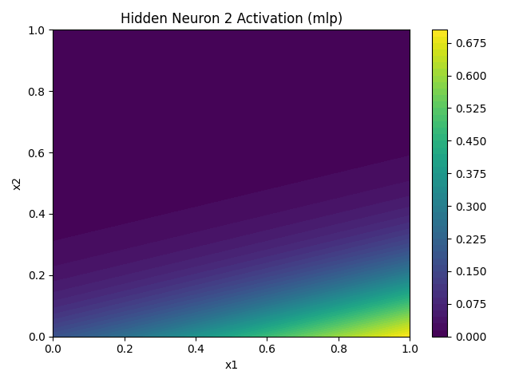  
*Activation values for hidden neuron 2 within the XOR input space, with incorrect results.*

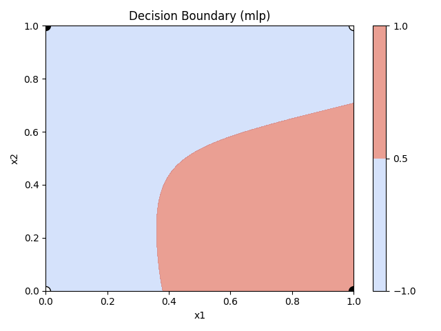  
*Decision boundary for an MLP trained on XOR data, with incorrect results.*

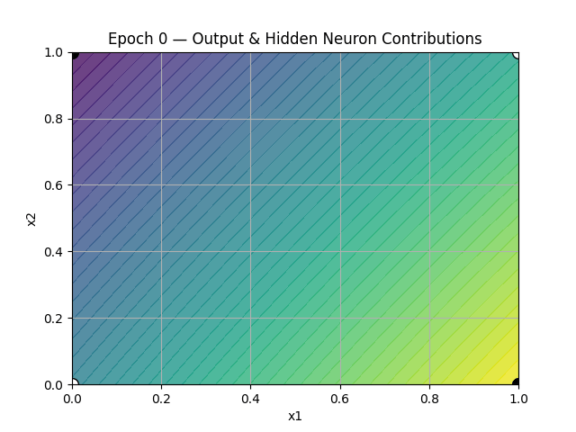  
*Animation of output neuron output overlaid with hidden neurons threshold values for the MLP trained on XOR data, with incorrect output for XOR. Green lines show the activation thresholds for hidden neuron 2, pink lines show the activation thresholds for hidden neuron 1. Output neuron values were produced by the function using the output weights and bias prior to being squashed by the sigmoid function. Note: Beginning frames are weighted in order to slow the animation progression during significant model changes.*

## Results and Discussion

ChatGPT was used extensively to clarify concepts and reach a deeper understanding of the roles and limitations of the components of a single perceptron model versus the MLP. Most of the descriptions provided by ChatGPT seemed to be logical, or were supported by experimental results. However, it would be beneficial to verify the explanations through external sources. Having the opportunity to question conceptual understanding at each stage of the work though was very helpful in guiding production of visualizations.

Though the hidden layers may produce complicated contributions to the ultimate output, in the case of the XOR training visualized above, a fairly straightforward decomposition of the XOR problem was produced. It would be interesting to keep training and visualizing to come up with a model where the hidden layers showed a clear asymmetry in contributions. It might be easier to do so with a slightly more complex example, perhaps with additional neurons in the hidden layer. Future work may include such modeling and visualization.

## Appendix: Highlights from ChatGPT Explanations
- A 2-2-1 network means there are 2 input neurons, 2 hidden neurons (in one hidden layer), and 1 output neuron
-- Each neuron in the hidden layer computes its own weighted sum and nonlinear activation. This enables the MLP to transform the input space before making a decision.
- Why is a single-layer perceptron like a straight line, and how hidden layers contribute to more complex functionality:
  - "The inputs can’t be transformed — they're passed straight into a single weighted sum and a sigmoid."
- Hidden neurons can create new features or partition space nonlinearly
- The output neuron combines these nonlinear features
  - The network can form composite decision boundaries
  - These intermediate layers allow the network to solve nonlinearly separable problems by chopping the space into smaller linear regions and combining them
- The network can form composite decision boundaries
- Hidden layers allow for compositional, nonlinear behavior
- The hidden layer is doing what in classical ML you'd call feature engineering - it’s building new intermediate representations (aka learned features) of the input.

Describing why a single perceptron is linear while hidden layers may be nonlinear:
Let’s start with the perceptron:
```
output = sigmoid(w1 * x1 + w2 * x2 + b)
```
This is:
- A linear combination of the inputs: z=w1x1+w2x2+bz=w1​x1​+w2​x2​+b
- Then passed through a sigmoid (or other activation)

But crucially — when drawing a decision boundary, you’re checking when the output is constant, like:
```
sigmoid(w1 * x1 + w2 * x2 + b) = 0.5
```
That’s equivalent to:
```
w1 * x1 + w2 * x2 + b = 0  # ← linear boundary
```
This defines a straight line (or hyperplane in higher dimensions).

So even though the sigmoid is nonlinear, the decision boundary (where output = threshold) is linear because it’s just where the weighted sum hits a constant.

Hidden neurons are nonlinear functions of linear combinations. Output neurons are nonlinear functions of hidden outputs. Their composition breaks linearity and gives rise to flexible decision surfaces.

- As noted above, MLP XOR training failed with hardcoded weights. ChatGPT said random initialization "breaks the symmetry and allows hidden neurons to specialize."
-- On digging in a bit more, ChatGPT indicated the 2 hidden neurons get the exact same updates for weights and bias when they start out the same, so they are essentially clones. As a result, the "network can’t learn anything more expressive than a single hidden unit"
- The hidden neuron activations don't necessarily look like a decomposition of an XOR, but each may still identify features that the output function is then able to compose into the correct output.

## Commands

Basic program commands to train models and produce visualizations.

Show decision boundary live:
```sh
python main.py --plots decision-boundary
```

Show and save XOR decision boundary animation:
```sh
python main.py --plots decision-boundary --skip-nand --gif
```

Full training for both, no animation:
```sh
python main.py --plots learning weights
```

Live view of plots for decision boundary, learning curve, and weights and bias, plus saved gifs:
```sh
python main.py --plots decision-boundary --gif --skip-nand
```

Train and create visualizations for MLP:
```sh
python test_mlp.py
```
