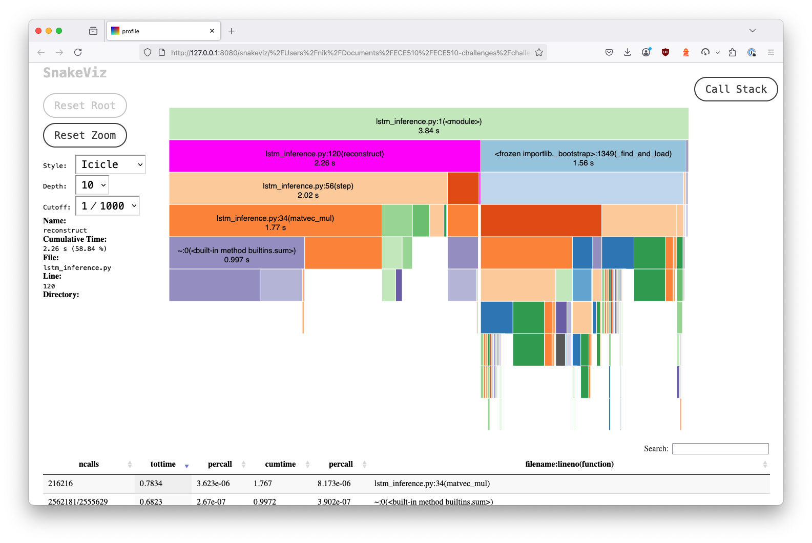

# Bootstrapping the Main Project

## Overview

The goal of [Challenge 9](#challenge-9-lstm-model) was to jumpstart work on the main project by choosing a candidate algorithm or problem which would benefit from hardware acceleration on a dedicated co-processor chiplet. The Heilmeier Questions were used as prompts to ensure focus on interesting and valuable work. With a candidate algorithm, analysis and code profiling was performed to identify bottlenecks and determine an initial hardware/software boundary.

In [Challenge 12](#challenge-12-hardware-acceleration), more detailed work was performed to determine a target execution time for the hardware accelerator. This was done by estimating required data transfer between the software execution on the CPU and the co-processor, given the software/hardware boundary chosen above.

Full LLM transcripts found in [LLM_TRANSCRIPT.md](./docs/LLM_TRANSCRIPT.md).

## Heilmeier Questions

Answers to questions from [the Heilmeier Catechism](https://www.darpa.mil/about/heilmeier-catechism) are below. These questions were used to guide thinking about how to focus on a valuable outcome, and how to approach the development process by setting expectations and standards for success.

**1. What are you trying to do? Articulate your objectives using absolutely no jargon.**  

I want to create a hardware accelerator for anomaly detection in weather data. Specifically, with this hardware accelerator, it should be possible to run AI workloads on sensor data in remote locations. Results could then be transmitted within the region to allow for timely response to changing conditions or critical weather events.

**2. How is it done today, and what are the limits of current practice?**  

Typically, this is currently done at a centralized compute location, after data has been transferred and aggregated. One of the main limitations is the significant data transfer involved. The data transfer and subsequent centralized analysis leads to latency in communicating the dangers of critical weather events.

**3. What is new in your approach and why do you think it will be successful?**  

In my approach, it should be possible to deploy remote inference stations that would be near to sensors collecting weather data. These stations could collect data from a handful of nearby sensors and perform inference after being trained on region-specific data. Rather than transmitting all sensor data back to a centralized location, these stations could transmit the model output locally, indicating whether conditions for a critical weather event (for example, a wildfire) have been detected.

**4. Who cares? If you are successful, what difference will it make?**  

If successful, this could open the door to having better early-warning systems for critical weather events. This could reduce the negative impacts of such events, allowing for greater planning and protection of people and property, and evacuation if necessary. It could help in resource management for such events by providing accurate information on which regions are most immediately at risk.

**5. What are the risks?**  

One of the risks is that the accelerator may not meet the efficiency requirements for low-power environments. Some environmental sensor stations are extremely power-limited (for example, a [Pico Balloon(https://en.wikipedia.org/wiki/High-altitude_balloon#Amateur_radio_high-altitude_ballooning)]), and it may be difficult to reduce power consumption enough to meet requirements, even using a hardware accelerator. However, there are other types of weather stations that may accommodate slightly greater power needs.

Another risk is in development of accurate prediction models for a given region, and the use of available sensor network data. To train such models, regional data needs to be available, along with appropriate interpretation from subject-matter experts. Though the algorithm I'm looking at using leverages unsupervised training, verification of results should be possible prior to deployment. In addition, these models will ideally be able to use currently-available sensor data, rather than requiring new or more expensive types of sensor data.

**6. How much will it cost?**  

Initial proof-of-concept work will be fairly limited in cost, but may require significant time commitment. Later in development, it may be possible to reduce costs by piggybacking onto other weather or environmental sensor projects by providing an extension to the existing functionality, instead of attempting to create a new sensor network from scratch dedicated to this project.

If initial development shows promise, wide-scale deployment would incur costs related to the hardware manufacturing for the hardware accelerator. In addition, there would be costs related to software development and integration of the new hardware into existing or new sensor network projects.

**7. How long will it take?**  

Exploratory work has already been done in identifying the bottlenecks for anomaly detection in weather data using the Long Short-Term Memory (LSTM) autoencoder algorithm written in Python. Estimation of communication costs and development of a target execution time are currently in progress. From here, creating basic hardware modules for the necessary components in SystemVerilog may be done over the next week or two. After that, 4-6 weeks should be reserved for iteration and refinement of the hardware, with the goal of creating a synthesizable design by week 8.

**8. What are the mid-term and final “exams” to check for success?**  

A mid-term checkpoint should contain a basic hardware simulation using SystemVerilog. At that point, algorithm bottlenecks will have been identified, and communication costs associated with the use of the hardware accelerator as a co-processor will be estimated. This will provide a target execution time for the hardware, based on the maximum execution time it may take while providing an improvement over the software-only approach.

A final exam would ideally result in a synthesizable chiplet providing hardware acceleration for the specific parts of the chosen algorithm designated as a bottleneck. Estimated execution time, including communication costs, should be less than the execution time of the software alone.

## Challenge 9: LSTM Model

Having used the Heilmeier Questions above and to determine the target for hardware acceleration as anomaly detection inference for weather data, a Long Short-Term Memory (LSTM) Autoencoder algorithm was chosen with guidance from ChatGPT. Data for the training was retrieved on April 16, 2025 from the [NOAA.gov archive for global marine data](https://www.ncei.noaa.gov/data/global-marine/archive/). The dataset for March, 2025 ([202503.tar.gz](https://www.ncei.noaa.gov/data/global-marine/archive/202503.tar.gz)) was chosen as the source. Specific data within that dataset were chosen based on whether there was a significant amount of source data present for training or testing inference.

With ChatGPT assistance, the model was trained on six features from the dataset: air temperature, sea surface temperature, sea level pressure, wind speed, wave height, and wave period. The raw data was made ready for training using a preprocessing script, within a training script which created files for the model itself, the weights, and a scaler, used to normalize new data to the model training data. The training script was configured to generate these files so that the inference script could be run separately, and ultimately, so that the weights could be used inside the hardware acceleration chiplet.

Next, the inference script was created and run using the saved weights and scaler in order to verify functionality. A `normalize_new_data.py` script was created so that novel data could be scaled appropriately for the model. Then new data was run through the inference script in order to check inference functionality. Options for output include plotting and CSV output for reconstruction error. An `extract_anomalies.py` script was also created in order to map identified anomalous time windows back to the original data. Examples of running these commands are found below in the [commands](#commands) section.

With a working inference script, profiling was performed in order to identify any bottlenecks that could be good candidates for hardware acceleration. Commands for running profiling are found below in the [Profiling and Analysis](#profiling-and-analysis) section.

### Training and Inference Results

Within the training script, the raw data was cleaned up using the preprocess script. This can also be run as a standalone script:
```sh
python preprocess_data.py data/10/100/00/110.csv --window_size 24
```

The training script itself was in order to generate files for the weights, along with a scaler file. The following output was seen when running the `train_lstm_autoencoder` script on the preprocessed data:

```sh
$ python train_lstm_autoencoder.py
Training on 476 sequences, shape: (24, 6)
Model: "sequential"
┏━━━━━━━━━━━━━━━━━━━━━━━━━━━━━━━━━━━━━━┳━━━━━━━━━━━━━━━━━━━━━━━━━━━━━┳━━━━━━━━━━━━━━━━━┓
┃ Layer (type)                         ┃ Output Shape                ┃         Param # ┃
┡━━━━━━━━━━━━━━━━━━━━━━━━━━━━━━━━━━━━━━╇━━━━━━━━━━━━━━━━━━━━━━━━━━━━━╇━━━━━━━━━━━━━━━━━┩
│ lstm (LSTM)                          │ (None, 24, 64)              │          18,176 │
├──────────────────────────────────────┼─────────────────────────────┼─────────────────┤
│ lstm_1 (LSTM)                        │ (None, 32)                  │          12,416 │
├──────────────────────────────────────┼─────────────────────────────┼─────────────────┤
│ repeat_vector (RepeatVector)         │ (None, 24, 32)              │               0 │
├──────────────────────────────────────┼─────────────────────────────┼─────────────────┤
│ lstm_2 (LSTM)                        │ (None, 24, 32)              │           8,320 │
├──────────────────────────────────────┼─────────────────────────────┼─────────────────┤
│ lstm_3 (LSTM)                        │ (None, 24, 64)              │          24,832 │
├──────────────────────────────────────┼─────────────────────────────┼─────────────────┤
│ time_distributed (TimeDistributed)   │ (None, 24, 6)               │             390 │
└──────────────────────────────────────┴─────────────────────────────┴─────────────────┘
 Total params: 64,134 (250.52 KB)
 Trainable params: 64,134 (250.52 KB)
 Non-trainable params: 0 (0.00 B)
Epoch 1/50
14/14 ━━━━━━━━━━━━━━━━━━━━ 3s 41ms/step - loss: 0.1224 - val_loss: 0.0351
Epoch 2/50
14/14 ━━━━━━━━━━━━━━━━━━━━ 0s 16ms/step - loss: 0.0444 - val_loss: 0.0305
Epoch 3/50
14/14 ━━━━━━━━━━━━━━━━━━━━ 0s 20ms/step - loss: 0.0337 - val_loss: 0.0251
Epoch 4/50
14/14 ━━━━━━━━━━━━━━━━━━━━ 0s 16ms/step - loss: 0.0280 - val_loss: 0.0233
Epoch 5/50
14/14 ━━━━━━━━━━━━━━━━━━━━ 0s 16ms/step - loss: 0.0265 - val_loss: 0.0219
Epoch 6/50
14/14 ━━━━━━━━━━━━━━━━━━━━ 0s 16ms/step - loss: 0.0246 - val_loss: 0.0218
Epoch 7/50
14/14 ━━━━━━━━━━━━━━━━━━━━ 0s 18ms/step - loss: 0.0239 - val_loss: 0.0202
Epoch 8/50
14/14 ━━━━━━━━━━━━━━━━━━━━ 0s 19ms/step - loss: 0.0231 - val_loss: 0.0203
Epoch 9/50
14/14 ━━━━━━━━━━━━━━━━━━━━ 0s 19ms/step - loss: 0.0225 - val_loss: 0.0198
Epoch 10/50
14/14 ━━━━━━━━━━━━━━━━━━━━ 0s 20ms/step - loss: 0.0221 - val_loss: 0.0196
Epoch 11/50
14/14 ━━━━━━━━━━━━━━━━━━━━ 0s 22ms/step - loss: 0.0216 - val_loss: 0.0197
Epoch 12/50
14/14 ━━━━━━━━━━━━━━━━━━━━ 0s 19ms/step - loss: 0.0218 - val_loss: 0.0192
Epoch 13/50
14/14 ━━━━━━━━━━━━━━━━━━━━ 0s 19ms/step - loss: 0.0214 - val_loss: 0.0191
Epoch 14/50
14/14 ━━━━━━━━━━━━━━━━━━━━ 0s 18ms/step - loss: 0.0214 - val_loss: 0.0193
Epoch 15/50
14/14 ━━━━━━━━━━━━━━━━━━━━ 0s 19ms/step - loss: 0.0212 - val_loss: 0.0189
Epoch 16/50
14/14 ━━━━━━━━━━━━━━━━━━━━ 0s 19ms/step - loss: 0.0212 - val_loss: 0.0188
Epoch 17/50
14/14 ━━━━━━━━━━━━━━━━━━━━ 0s 19ms/step - loss: 0.0211 - val_loss: 0.0190
Epoch 18/50
14/14 ━━━━━━━━━━━━━━━━━━━━ 0s 19ms/step - loss: 0.0212 - val_loss: 0.0187
Epoch 19/50
14/14 ━━━━━━━━━━━━━━━━━━━━ 0s 23ms/step - loss: 0.0208 - val_loss: 0.0186
Epoch 20/50
14/14 ━━━━━━━━━━━━━━━━━━━━ 0s 19ms/step - loss: 0.0207 - val_loss: 0.0185
Epoch 21/50
14/14 ━━━━━━━━━━━━━━━━━━━━ 0s 19ms/step - loss: 0.0209 - val_loss: 0.0185
Epoch 22/50
14/14 ━━━━━━━━━━━━━━━━━━━━ 0s 19ms/step - loss: 0.0204 - val_loss: 0.0184
Epoch 23/50
14/14 ━━━━━━━━━━━━━━━━━━━━ 0s 19ms/step - loss: 0.0205 - val_loss: 0.0185
Epoch 24/50
14/14 ━━━━━━━━━━━━━━━━━━━━ 0s 19ms/step - loss: 0.0207 - val_loss: 0.0183
Epoch 25/50
14/14 ━━━━━━━━━━━━━━━━━━━━ 0s 19ms/step - loss: 0.0205 - val_loss: 0.0185
Epoch 26/50
14/14 ━━━━━━━━━━━━━━━━━━━━ 0s 25ms/step - loss: 0.0207 - val_loss: 0.0186
Epoch 27/50
14/14 ━━━━━━━━━━━━━━━━━━━━ 0s 19ms/step - loss: 0.0205 - val_loss: 0.0183
Epoch 28/50
14/14 ━━━━━━━━━━━━━━━━━━━━ 0s 19ms/step - loss: 0.0204 - val_loss: 0.0185
Epoch 29/50
14/14 ━━━━━━━━━━━━━━━━━━━━ 0s 18ms/step - loss: 0.0205 - val_loss: 0.0182
Epoch 30/50
14/14 ━━━━━━━━━━━━━━━━━━━━ 0s 19ms/step - loss: 0.0204 - val_loss: 0.0182
Epoch 31/50
14/14 ━━━━━━━━━━━━━━━━━━━━ 0s 19ms/step - loss: 0.0205 - val_loss: 0.0182
Epoch 32/50
14/14 ━━━━━━━━━━━━━━━━━━━━ 0s 19ms/step - loss: 0.0202 - val_loss: 0.0182
Epoch 33/50
14/14 ━━━━━━━━━━━━━━━━━━━━ 0s 19ms/step - loss: 0.0201 - val_loss: 0.0184
Epoch 34/50
14/14 ━━━━━━━━━━━━━━━━━━━━ 0s 22ms/step - loss: 0.0200 - val_loss: 0.0181
Epoch 35/50
14/14 ━━━━━━━━━━━━━━━━━━━━ 0s 19ms/step - loss: 0.0199 - val_loss: 0.0183
Epoch 36/50
14/14 ━━━━━━━━━━━━━━━━━━━━ 0s 19ms/step - loss: 0.0200 - val_loss: 0.0182
Epoch 37/50
14/14 ━━━━━━━━━━━━━━━━━━━━ 0s 19ms/step - loss: 0.0200 - val_loss: 0.0181
Epoch 38/50
14/14 ━━━━━━━━━━━━━━━━━━━━ 0s 19ms/step - loss: 0.0201 - val_loss: 0.0181
Epoch 39/50
14/14 ━━━━━━━━━━━━━━━━━━━━ 0s 19ms/step - loss: 0.0206 - val_loss: 0.0183
Epoch 40/50
14/14 ━━━━━━━━━━━━━━━━━━━━ 0s 19ms/step - loss: 0.0204 - val_loss: 0.0182
Epoch 41/50
14/14 ━━━━━━━━━━━━━━━━━━━━ 0s 22ms/step - loss: 0.0201 - val_loss: 0.0180
Epoch 42/50
14/14 ━━━━━━━━━━━━━━━━━━━━ 0s 19ms/step - loss: 0.0201 - val_loss: 0.0181
Epoch 43/50
14/14 ━━━━━━━━━━━━━━━━━━━━ 0s 19ms/step - loss: 0.0198 - val_loss: 0.0181
Epoch 44/50
14/14 ━━━━━━━━━━━━━━━━━━━━ 0s 19ms/step - loss: 0.0200 - val_loss: 0.0180
Epoch 45/50
14/14 ━━━━━━━━━━━━━━━━━━━━ 0s 19ms/step - loss: 0.0200 - val_loss: 0.0178
Epoch 46/50
14/14 ━━━━━━━━━━━━━━━━━━━━ 0s 20ms/step - loss: 0.0199 - val_loss: 0.0178
Epoch 47/50
14/14 ━━━━━━━━━━━━━━━━━━━━ 0s 19ms/step - loss: 0.0199 - val_loss: 0.0181
Epoch 48/50
14/14 ━━━━━━━━━━━━━━━━━━━━ 0s 19ms/step - loss: 0.0198 - val_loss: 0.0179
Epoch 49/50
14/14 ━━━━━━━━━━━━━━━━━━━━ 0s 22ms/step - loss: 0.0199 - val_loss: 0.0177
Epoch 50/50
14/14 ━━━━━━━━━━━━━━━━━━━━ 0s 19ms/step - loss: 0.0196 - val_loss: 0.0177
Model saved to: saved_model/lstm_autoencoder.keras
Weights saved to: saved_model/lstm_weights.npz
Scaler saved to: saved_model/scaler.gz
```

Reconstruction error plots were generated to understand the model's functionality. Much later after the initial training and implementation of an inference script was performed, while work was being done on exporting and validating weights for the hardware implementation, it was discovered that the original inference script was not transposing the weights as it needed to do. This was discovered while examining the inputs and outputs at difference points withing the `step` function, and seeing that the `tanh` activation function was consistently receiving zero value inputs. After fixing the weight transposition, the model accuracy improved significantly, while the execution time increased dramatically from under 4 seconds to around 1 minute.

  
*This initial plot of reconstruction error on training data shows a relatively high error rate, given that this was inference run on the same data as used in training.*

  
*This alternate plot of reconstruction error on training data shows a significantly improved error rate.*

  
*The initial snakeviz output showed the overall script execution time to be just under 4 seconds.*

  
*After fixing the weight loading transposition issue, the overall script execution time rose dramatically to around 1 minute.*

### Commands

For inference, there are multiple modes. Running inference on the original data is the default:
```sh
python lstm_inference.py
```

Running inference on new data which has been normalized can be accomplished with the following:
```sh
python lstm_inference.py --npz new_data_sequences.npz
```

Plotting data can be done with the following:
```sh
python lstm_inference.py --plot
```

CSV output mode is available as well, and the following command will output the MSE values to a CSV:
```sh
python lstm_inference.py --csv
```

Output a CSV with the window index and MSE for anomalies, as determined by the 95% threshhold:
```sh
python lstm_inference.py --anomalies
```

To trace anomalies back to raw data:
```sh
python extract_anomalies.py
```

### Profiling and Analysis

Generate a prof file to use with snakeviz:
```sh
python -m cProfile -o profile.lstm.prof lstm_inference.py --npz new_data_sequences.npz
snakeviz profile.lstm.prof
```

Results from using `kernprof` (with the actual MSE inference output removed):
```sh
(venv) ➜  challenge-9 git:(main) ✗ kernprof -l -v lstm_inference.py --npz new_data_sequences.npz

Wrote profile results to lstm_inference.py.lprof
Timer unit: 1e-06 s

Total time: 74.2436 s
File: /Users/nik/Documents/ECE510/ECE510-challenges/challenge-09/lstm_core.py
Function: matvec_mul at line 38

Line #      Hits         Time  Per Hit   % Time  Line Contents
==============================================================
    38                                           @profile
    39                                           def matvec_mul(matrix, vec):
    40  10319400   74243571.0      7.2    100.0      return [sum(m * v for m, v in zip(row, vec)) for row in matrix]

Total time: 79.0594 s
File: /Users/nik/Documents/ECE510/ECE510-challenges/challenge-09/lstm_core.py
Function: step at line 62

Line #      Hits         Time  Per Hit   % Time  Line Contents
==============================================================
    62                                               @profile
    63                                               def step(self, x, h_prev, c_prev):
    64     52416     404356.0      7.7      0.5          i = vector_sigmoid(
    65     52416     124803.0      2.4      0.2              elementwise_add(
    66     26208    6933091.0    264.5      8.8                  matvec_mul(self.W_i, x),
    67     26208   12092290.0    461.4     15.3                  elementwise_add(matvec_mul(self.U_i, h_prev), self.b_i),
    68                                                       )
    69                                                   )
    70     52416     395975.0      7.6      0.5          f = vector_sigmoid(
    71     52416     123374.0      2.4      0.2              elementwise_add(
    72     26208    6943935.0    265.0      8.8                  matvec_mul(self.W_f, x),
    73     26208   12114833.0    462.3     15.3                  elementwise_add(matvec_mul(self.U_f, h_prev), self.b_f),
    74                                                       )
    75                                                   )
    76     52416     330478.0      6.3      0.4          c_tilde = vector_tanh(
    77     52416     122923.0      2.3      0.2              elementwise_add(
    78     26208    7001467.0    267.1      8.9                  matvec_mul(self.W_c, x),
    79     26208   12138722.0    463.2     15.4                  elementwise_add(matvec_mul(self.U_c, h_prev), self.b_c),
    80                                                       )
    81                                                   )
    82     52416     400892.0      7.6      0.5          o = vector_sigmoid(
    83     52416     134296.0      2.6      0.2              elementwise_add(
    84     26208    6884994.0    262.7      8.7                  matvec_mul(self.W_o, x),
    85     26208   12105520.0    461.9     15.3                  elementwise_add(matvec_mul(self.U_o, h_prev), self.b_o),
    86                                                       )
    87                                                   )
    88                                                   # print(
    89                                                   #     f"[debug] i={i[0]:.4f}, f={f[0]:.4f}, c_tilde={c_tilde[0]:.4f}, o={o[0]:.4f}"
    90                                                   # )
    91     26208     353779.0     13.5      0.4          c = elementwise_add(elementwise_mul(f, c_prev), elementwise_mul(i, c_tilde))
    92     26208     438571.0     16.7      0.6          h = elementwise_mul(o, vector_tanh(c))
    93     26208      15111.0      0.6      0.0          return h, c

Total time: 0.460245 s
File: /Users/nik/Documents/ECE510/ECE510-challenges/challenge-09/lstm_core.py
Function: forward at line 102

Line #      Hits         Time  Per Hit   % Time  Line Contents
==============================================================
   102                                               @profile
   103                                               def forward(self, x):
   104      6552     460245.0     70.2    100.0          return elementwise_add(matvec_mul(self.W, x), self.b)

Total time: 79.7733 s
File: lstm_inference.py
Function: reconstruct at line 77

Line #      Hits         Time  Per Hit   % Time  Line Contents
==============================================================
    77                                               @profile
    78                                               def reconstruct(self, sequence):
    79       273        284.0      1.0      0.0          h1 = [0.0] * self.hidden1
    80       273        122.0      0.4      0.0          c1 = [0.0] * self.hidden1
    81       273         70.0      0.3      0.0          h2 = [0.0] * self.hidden2
    82       273         55.0      0.2      0.0          c2 = [0.0] * self.hidden2
    83                                           
    84      6825       1563.0      0.2      0.0          for x in sequence:
    85      6552   23176784.0   3537.4     29.1              h1, c1 = self.lstm1.step(x, h1, c1)
    86      6552   15316614.0   2337.7     19.2              h2, c2 = self.lstm2.step(h1, h2, c2)
    87                                           
    88                                                   # print(f"final h1 after encoder: len={len(h1)}")
    89                                           
    90      6825       1851.0      0.3      0.0          repeated = [h2 for _ in range(len(sequence))]
    91                                                   # print(f"h2 = {h2}, len = {len(h2)}")
    92                                                   # print(f"repeated[0] = {repeated[0]}, len = {len(repeated[0])}")
    93       273        320.0      1.2      0.0          h3 = [0.0] * self.hidden3
    94       273        100.0      0.4      0.0          c3 = [0.0] * self.hidden3
    95       273        100.0      0.4      0.0          h4 = [0.0] * self.hidden4
    96       273         70.0      0.3      0.0          c4 = [0.0] * self.hidden4
    97                                           
    98       273         37.0      0.1      0.0          output_seq = []
    99      6825       1612.0      0.2      0.0          for x in repeated:
   100      6552   10763949.0   1642.8     13.5              h3, c3 = self.lstm3.step(x, h3, c3)
   101      6552   30035085.0   4584.1     37.7              h4, c4 = self.lstm4.step(h3, h4, c4)
   102      6552     472728.0     72.2      0.6              y = self.dense.forward(h4)
   103      6552       1681.0      0.3      0.0              output_seq.append(y)
   104                                           
   105       273        271.0      1.0      0.0          return output_seq
```

### Results

Despite the issue that was identified between initial profiling and later, corrected profiling, the same bottleneck was found: the `matvec_mul` function within the `step` function. The `step` function contained additional time-intensive computational tasks such as the activation functions and elementwise addition and multiplication, though clearly the matrix-vector multiplication was the most significant factor.

It would be interesting to dig deeper to understand what specifically allowed the original, erroneous script to complete so quickly. There is a hint as to what was happening which is visible when comparing the `kernprof` outputs. The original inference profiling included `2771496` hits to the list comprehension used within `matvec_mul`. The fixed version had `10319400` hits to this line, around a 3.7-fold increase. Calls to other functions or lines of execution appear unchanged. This indicates that the row or vector dimensions were seen as being much larger in the fixed version.

The issue with the weight transposition highlights potential problems that may arise when using LLM guidance without having significant domain knowledge. Despite an effort to trace inference outputs back to the raw data as a form of error-checking, it is difficult to verify functionality without experience using such models.

## Challenge 12: Hardware Acceleration

### Hardware Execution Time

The following estimations are related to Challenge 12. The HW / SW boundary was determined using the above profiling, and the results from interactive visualization with snakeviz. The snakeviz results indicated that the `matvec_mul` operation contributed significantly to the overall execution time. The encapsulating `step` function therefore is a good target, as it represents a slightly higher percentage of the overall execution time than the cumulative `matvec_mul` steps, and also provides a larger discrete functional block to implement in hardware, reducing the communication costs that would be associated with implementing *only* the `matvec_mul` in hardware.

Goals for estimating communication cost:
- Get baseline for a protocol like PCIe or similar
- Get estimate of amount of data that would be transferred to hardware
- The above should provide a basic estimate of communication cost
- From there, the existing software-only computational bottleneck minus the communication cost (round-trip) should represent a target execution time that the hardware should be faster than

### Notes From ChatGPT Estimation

For the `step` function, we can save on communication cost by saving the weights in SRAM. This should be estimated and considered as part of the whole hardware cost.

Chiplet optimizations that may improve data transfer efficiency:
- Holds weights (W, U, b) locally in SRAM → no transfer needed
- Chains layers internally (LSTM1 → LSTM2) → you save intermediate transfers
- Implements on-chip h/c buffering → only stream x in and h out

Best-Case Streamed Input:
- Just send x per timestep, receive h
- ~24 × (input_size + hidden_size) × 4 = much smaller

Estimated PCIe transfer latency = ~607 ns per step

Assumes 200MHz clock cycle. This might be fast for an FPGA, but (I think) dedicated hardware should easily meet or surpass this speed.

Assumes PCIe Gen 4 utilizing 4 lanes, estimates 5 GB/s transfer speeds.
- Assumes latency of 500 ns–1.5 µs

Total latency per step (*with* ballpark for execution time) | ~1.5 µs → 1.6 µs
Total SRAM needed (to store weights) | ~84 KB

ChatGPT estimated 45,696 step calls; snakeviz indicated there were 26,208.

ChatGPT's total estimated time based on 45K step calls was:
```
45,696 × 1.5 µs = 68,544 µs ≈ 68.5 milliseconds total
```

*Note*: There was some initial confusion in the estimatation, where ChatGPT was including a rough estimate for the execution time in hardware as well as the data transfer time. This was clarified, and the summary numbers below reflect a target execution time for the `step` function based on estimated data transfer times.

### Summary
- The estimated *per-step* communication cost is ~607ns, based on estimated data transfer size and usage of PCIe gen 4. This assumes the weights are stored in SRAM to reduce data transfer.
- The estimated *total* communication cost is pessimistically ~27.74 ms. This was based on number of step calls in the training data set. The number of step calls profiled using snakeviz was significantly lower, so we may estimate a lower bound at `26208 * 607ns = 15.91 ms`.
- Total compute time allowed for all `step` function calls is `2 s - 27.74 ms = ~1972.26 ms`, using pessimistic estimate above
- The **maximum total target execution time** for our hardware `step` function (using the pessemistic estimate) is `1.972 / 45696 = ~43.15 µs`.
- An estimated ~84 KB of SRAM will be needed to store the weights.
- Additional data transfer optimization may be done by implementing on-chip h/c buffering, which would mean we only stream `x` in and `h` out
