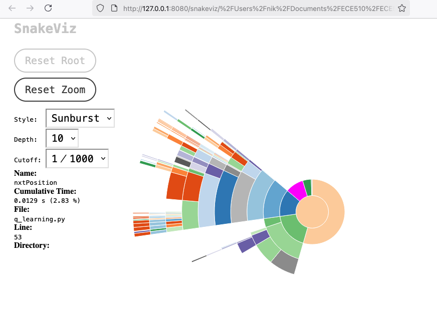
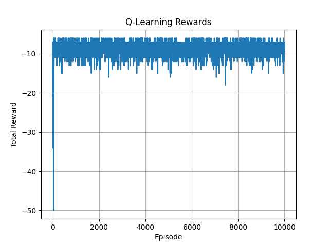
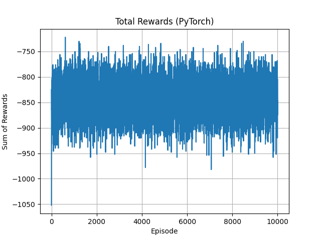
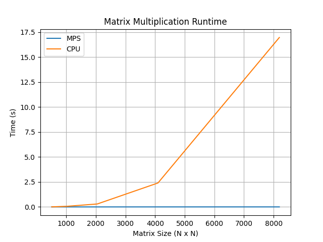

# Computational Bottlenecks

**Niklas Anderson**  
**April 2025**

## Overview

Challenge 10 involved identifying computational bottlenecks, with LLM assistance, in a Q Learning algorithm applied to a Frozen Lake reinforcement learning task. LLM suggestions were evaluated, and a SystemVerilog implementation was generated.

Next, for Challenge 11, the LLM was prompted to produce code optimized for GPU execution. ChatGPT was not able to provide a working version of this code. In order to make a basic comparison of CPU versus GPU execution of code, another script was created for benchmarking. In this case, the GPU performance advantage was apparent.

Full LLM transcripts found in [LLM_TRANSCRIPT.md](./docs/LLM_TRANSCRIPT.md).

## ChatGPT Suggestions

### Initial Identification of Computational Bottlenecks

ChatGPT identified 5 main areas as potential bottlenecks. The first was focused on Q-Table lookups and updates, as well as the copying of the computed new Q values into the existing Q value table. It did not suggest any alternative for the dictionary lookups, but did note the O(1) for dictionary lookups and O(n) for the copy. The O(n) copy seems like the more likely candidate for an improvement in this case, since a constant O(1) may be difficult to improve on, despite the cumulative cost.

ChatGPT cited an inefficient iteration over `HOLE_STATE` in two different places. Fixing this inefficiency seems relatively simple, and there are two functions which are impacted by it. These functions are called within the computation-intensive `Q_Learning` method, so it seems like a good place to target code speedups in. On the other hand, the length of the list of holes is always going to be a relatively small proportion of the entire grid size, so it seems unlikely that this is the biggest computationally intensive section. However, if it is a quick fix, it would be worth changing.

The repeated `State` object reinstantation within the `Q_Learning` method was also cited by ChatGPT. This does seem like a reasonable suggestions for improvement, though profiling would help in determining the exact impact of this specific reinstantiation.

The fourth bottleneck noted by ChatGPT was some redundant code in the `Q_Learning` method, where the actions were iterated over in two different branches of a conditional. ChatGPT suggested merging or optimizing these loops. However, since the two different loops were in different branches of an `if...else`, they should never both run on an iteration. This suggestion seems to make the least sense of the possible bottlenecks.

The last potential bottleneck noted by ChatGPT was the plotting overhead. This doesn't seem like a significant bottleneck, and ChatGPT did not provide much insight into any possible improvements, simply noting the current approach is less expensive than live plotting.

ChatGPT concluded by offering some quick optimization suggestions. One of these was quite straightforward and seemed reasonable, such as using a `set` for `HOLE_STATE` rather than a `list`. The rest were a bit more involved, and ChatGPT did not describe them in-depth. It's unclear whether these suggestions would truly be quick to implement or not.

ChatGPT did not identify the multiply-accumulate (MAC) operation as a primary computational bottlenecks until asked explicitly about hardware implementation. With that prompt, ChatGPT quickly identified the MAC operation within the `Q_Learning` method.

### Profiling of Code

Running ChatGPT's initial suggestion for basic profiling produced the following:

```sh
➜  challenge-10 git:(main) ✗ python -m cProfile -s tottime q_learning.py 
{(0, 0, 0): 0, (0, 0, 1): 0, (0, 0, 2): 0, (0, 0, 3): 0, (0, 1, 0): 0, (0, 1, 1): 0, (0, 1, 2): 0, (0, 1, 3): 0, (0, 2, 0): 0, (0, 2, 1): 0, (0, 2, 2): 0, (0, 2, 3): 0, (0, 3, 0): 0, (0, 3, 1): 0, (0, 3, 2): 0, (0, 3, 3): 0, (0, 4, 0): 0, (0, 4, 1): 0, (0, 4, 2): 0, (0, 4, 3): 0, (1, 0, 0): 0, (1, 0, 1): 0, (1, 0, 2): 0, (1, 0, 3): 0, (1, 1, 0): 0, (1, 1, 1): 0, (1, 1, 2): 0, (1, 1, 3): 0, (1, 2, 0): 0, (1, 2, 1): 0, (1, 2, 2): 0, (1, 2, 3): 0, (1, 3, 0): 0, (1, 3, 1): 0, (1, 3, 2): 0, (1, 3, 3): 0, (1, 4, 0): 0, (1, 4, 1): 0, (1, 4, 2): 0, (1, 4, 3): 0, (2, 0, 0): 0, (2, 0, 1): 0, (2, 0, 2): 0, (2, 0, 3): 0, (2, 1, 0): 0, (2, 1, 1): 0, (2, 1, 2): 0, (2, 1, 3): 0, (2, 2, 0): 0, (2, 2, 1): 0, (2, 2, 2): 0, (2, 2, 3): 0, (2, 3, 0): 0, (2, 3, 1): 0, (2, 3, 2): 0, (2, 3, 3): 0, (2, 4, 0): 0, (2, 4, 1): 0, (2, 4, 2): 0, (2, 4, 3): 0, (3, 0, 0): 0, (3, 0, 1): 0, (3, 0, 2): 0, (3, 0, 3): 0, (3, 1, 0): 0, (3, 1, 1): 0, (3, 1, 2): 0, (3, 1, 3): 0, (3, 2, 0): 0, (3, 2, 1): 0, (3, 2, 2): 0, (3, 2, 3): 0, (3, 3, 0): 0, (3, 3, 1): 0, (3, 3, 2): 0, (3, 3, 3): 0, (3, 4, 0): 0, (3, 4, 1): 0, (3, 4, 2): 0, (3, 4, 3): 0, (4, 0, 0): 0, (4, 0, 1): 0, (4, 0, 2): 0, (4, 0, 3): 0, (4, 1, 0): 0, (4, 1, 1): 0, (4, 1, 2): 0, (4, 1, 3): 0, (4, 2, 0): 0, (4, 2, 1): 0, (4, 2, 2): 0, (4, 2, 3): 0, (4, 3, 0): 0, (4, 3, 1): 0, (4, 3, 2): 0, (4, 3, 3): 0, (4, 4, 0): 0, (4, 4, 1): 0, (4, 4, 2): 0, (4, 4, 3): 0}
{(0, 0, 0): -5.735, (0, 0, 1): -5.499, (0, 0, 2): -5.735, (0, 0, 3): -5.262, (0, 1, 0): -5.262, (0, 1, 1): -4.736, (0, 1, 2): -5.735, (0, 1, 3): -4.736, (0, 2, 0): -4.736, (0, 2, 1): -4.152, (0, 2, 2): -5.262, (0, 2, 3): -4.153, (0, 3, 0): -4.146, (0, 3, 1): -5.499, (0, 3, 2): -4.73, (0, 3, 3): -3.504, (0, 4, 0): -3.469, (0, 4, 1): -2.783, (0, 4, 2): -4.013, (0, 4, 3): -3.472, (1, 0, 0): -5, (1, 0, 1): -5, (1, 0, 2): -5, (1, 0, 3): -5, (1, 1, 0): -5.262, (1, 1, 1): -4.152, (1, 1, 2): -5.499, (1, 1, 3): -4.152, (1, 2, 0): -4.736, (1, 2, 1): -3.503, (1, 2, 2): -4.736, (1, 2, 3): -5.499, (1, 3, 0): -5, (1, 3, 1): -5, (1, 3, 2): -5, (1, 3, 3): -5, (1, 4, 0): -3.499, (1, 4, 1): -1.982, (1, 4, 2): -5.498, (1, 4, 3): -2.751, (2, 0, 0): -4.812, (2, 0, 1): -3.792, (2, 0, 2): -4.013, (2, 0, 3): -3.926, (2, 1, 0): -4.63, (2, 1, 1): -5.49, (2, 1, 2): -4.253, (2, 1, 3): -3.503, (2, 2, 0): -4.152, (2, 2, 1): -2.782, (2, 2, 2): -4.152, (2, 2, 3): -2.782, (2, 3, 0): -5.499, (2, 3, 1): -1.98, (2, 3, 2): -3.503, (2, 3, 3): -1.981, (2, 4, 0): -2.783, (2, 4, 1): -1.091, (2, 4, 2): -2.782, (2, 4, 3): -1.977, (3, 0, 0): -3.641, (3, 0, 1): -3.668, (3, 0, 2): -3.366, (3, 0, 3): -5.156, (3, 1, 0): -5, (3, 1, 1): -5, (3, 1, 2): -5, (3, 1, 3): -5, (3, 2, 0): -3.501, (3, 2, 1): -5.499, (3, 2, 2): -5.499, (3, 2, 3): -1.98, (3, 3, 0): -2.782, (3, 3, 1): -1.089, (3, 3, 2): -2.782, (3, 3, 3): -1.09, (3, 4, 0): -1.981, (3, 4, 1): -0.1, (3, 4, 2): -1.98, (3, 4, 3): -1.09, (4, 0, 0): -3.733, (4, 0, 1): -3.698, (4, 0, 2): -3.67, (4, 0, 3): -3.715, (4, 1, 0): -4.125, (4, 1, 1): -3.674, (4, 1, 2): -3.757, (4, 1, 3): -4.125, (4, 2, 0): -5, (4, 2, 1): -5, (4, 2, 2): -5, (4, 2, 3): -5, (4, 3, 0): -1.98, (4, 3, 1): -1.089, (4, 3, 2): -5.499, (4, 3, 3): -0.099, (4, 4, 0): 1, (4, 4, 1): 1, (4, 4, 2): 1, (4, 4, 3): 1}
-----------------------------------------------
| -5.262 | -4.736 | -4.152 | -3.504 | -2.783 | 
-----------------------------------------------
| -5     | -4.152 | -3.503 | -5     | -1.982 | 
-----------------------------------------------
| -3.792 | -3.503 | -2.782 | -1.98  | -1.091 | 
-----------------------------------------------
| -3.366 | -5     | -1.98  | -1.089 | -0.1   | 
-----------------------------------------------
| -3.67  | -3.674 | -5     | -0.099 | 1      | 
-----------------------------------------------
         2028162 function calls (2007755 primitive calls) in 1.610 seconds

   Ordered by: internal time

   ncalls  tottime  percall  cumtime  percall filename:lineno(function)
        1    0.209    0.209    0.453    0.453 q_learning.py:135(Q_Learning)
     59/7    0.129    0.002    1.639    0.234 text.py:65(_get_text_metrics_with_cache)
    45/42    0.090    0.002    0.094    0.002 {built-in method _imp.create_dynamic}
    82961    0.079    0.000    0.141    0.000 q_learning.py:106(Action)
        1    0.077    0.077    0.149    0.149 backend_bases.py:2646(create_with_canvas)
      290    0.065    0.000    0.065    0.000 {method 'read' of '_io.BufferedReader' objects}
     7555    0.046    0.000    0.089    0.000 inspect.py:882(cleandoc)
        1    0.043    0.043    0.043    0.043 {function FigureManagerMac.destroy at 0x1076d56c0}
        1    0.035    0.035    0.069    0.069 backend_macosx.py:151(__init__)
      290    0.031    0.000    0.031    0.000 {built-in method marshal.loads}
   122983    0.030    0.000    0.030    0.000 {built-in method builtins.round}
    93006    0.026    0.000    0.026    0.000 {method 'copy' of 'dict' objects}
        1    0.024    0.024    0.025    0.025 backend_macosx.py:118(__init__)
        1    0.020    0.020    0.020    0.020 {method '_show' of 'matplotlib.backends._macosx.FigureManager' objects}
    92961    0.020    0.000    0.020    0.000 q_learning.py:33(getReward)
      5/4    0.019    0.004    0.204    0.051 backend_agg.py:206(get_text_width_height_descent)
    82961    0.019    0.000    0.019    0.000 q_learning.py:44(isEndFunc)
      456    0.018    0.000    0.018    0.000 {built-in method builtins.dir}
       40    0.017    0.000    0.017    0.000 {method 'set_message' of 'matplotlib.backends._macosx.NavigationToolbar2' objects}
      227    0.017    0.000    0.060    0.000 artist.py:1433(get_aliases)
    84675    0.016    0.000    0.016    0.000 {built-in method builtins.getattr}
    10247    0.016    0.000    0.016    0.000 {method 'search' of 're.Pattern' objects}
    98397    0.015    0.000    0.015    0.000 {method 'startswith' of 'str' objects}
      227    0.014    0.000    0.045    0.000 artist.py:1511(get_setters)
    82961    0.013    0.000    0.013    0.000 q_learning.py:53(nxtPosition)
    45/42    0.013    0.000    0.018    0.000 {built-in method _imp.exec_dynamic}
    89171    0.011    0.000    0.011    0.000 {method 'lstrip' of 'str' objects}
1115/1027    0.011    0.000    0.288    0.000 {built-in method builtins.__build_class__}
173419/172216    0.011    0.000    0.011    0.000 {built-in method builtins.len}
     8661    0.010    0.000    0.010    0.000 {method 'reduce' of 'numpy.ufunc' objects}
       32    0.010    0.000    0.010    0.000 {built-in method posix.listdir}
    63497    0.010    0.000    0.010    0.000 {built-in method builtins.min}
        7    0.010    0.001    0.010    0.001 backend_agg.py:93(draw_path)
    79368    0.009    0.000    0.012    0.000 {built-in method builtins.isinstance}
        1    0.008    0.008    0.008    0.008 {built-in method set_icon}
     8369    0.008    0.000    0.022    0.000 fromnumeric.py:69(_wrapreduction)
     4409    0.008    0.000    0.108    0.000 artist.py:1461(get_valid_values)
      965    0.007    0.000    0.009    0.000 inspect.py:3029(__init__)
      290    0.007    0.000    0.007    0.000 {built-in method _io.open_code}
     6875    0.007    0.000    0.013    0.000 inspect.py:2743(__init__)
        1    0.007    0.007    0.007    0.007 _linalg.py:2394(lstsq)
16348/16345    0.006    0.000    0.007    0.000 {method 'join' of 'str' objects}
        6    0.006    0.001    0.006    0.001 _common.py:13(tzname_in_python2)
    82961    0.006    0.000    0.006    0.000 {method 'random' of '_random.Random' objects}
     9254    0.006    0.000    0.006    0.000 {method 'split' of 'str' objects}
    92962    0.006    0.000    0.006    0.000 q_learning.py:28(__init__)
```

Visualization with Snakeviz, along with interpretation of results by ChatGPT, confirmed that the most significant computation time came from the cumulative costs of many relatively quick operations.

  
*Snakeviz interactive profiling, showing `nxtPosition` contribution to execution time, within `Action`.*

## SystemVerilog Implementation

ChatGPT was prompted to provide an implementation in SystemVerilog of the identified bottleneck that would be most suitable for hardware acceleration. As noted above, ChatGPT identified the MAC operation in the following line of code:
```python
q_value = (1 - self.alpha) * self.Q[(i, j, action)] + self.alpha * (
    reward + self.gamma * self.Q[nxtStateAction]
)
```

Though the provided implementation was largely reasonable, there were significant issues with the code. The main issue was that ChatGPT treated code inside an `always_ff` block as though it were a combinational rather than sequential block. Specifically, it used blocking assignment inside the `always_ff`, which is illegal, and the sequence of operations implied a blocking series of assignments. For example, there was a `start` signal set to one at the beginning of the block, and reset to zero at the end. This makes no sense within the context of a registered block of code.

Other than clear issues with the translation to hardware, the basic operations for the MAC operation itself seemed correct.

The code was updated to correct the issues with sequential and combinational logic referenced above. Further testing is required for complete functional verification.

## Optimization for GPU

ChatGPT was prompted to produce a version of the original Q-Learning algorithm optimized for GPU execution.

### Profiling

Original:
```sh
(venv) ➜  challenge-10 git:(main) ✗ kernprof -l -v q_learning.py
Wrote profile results to q_learning.py.lprof
Timer unit: 1e-06 s

Total time: 0.777938 s
File: q_learning.py
Function: run_q_learning at line 132

Line #      Hits         Time  Per Hit   % Time  Line Contents
==============================================================
   132                                           @profile
   133                                           def run_q_learning(episodes=10000):
   134         1         43.0     43.0      0.0      ag = Agent()
   135         1     777894.0 777894.0    100.0      ag.Q_Learning(episodes)
   136         1          1.0      1.0      0.0      return ag.plot_reward
```

Optimized for GPU:
```sh
(venv) ➜  challenge-10 git:(main) ✗ kernprof -l -v pytorch_q_learning.py
Wrote profile results to pytorch_q_learning.py.lprof
Timer unit: 1e-06 s

Total time: 2.12775 s
File: pytorch_q_learning.py
Function: run_pytorch_q_learning at line 53

Line #      Hits         Time  Per Hit   % Time  Line Contents
==============================================================
    53                                           @profile
    54                                           def run_pytorch_q_learning(num_agents=512, max_steps=10000):
    55                                               global Q  # Reuse Q-table across runs
    56         1       2149.0   2149.0      0.1      states = START.repeat(num_agents, 1)
    57         1          1.0      1.0      0.0      rewards_history = []
    58     10001       3164.0      0.3      0.1      for step in range(max_steps):
    59     10000      54210.0      5.4      2.5          actions = torch.randint(0, NUM_ACTIONS, (num_agents,), device=device)
    60     10000     752329.0     75.2     35.4          next_states = compute_next_states(states, actions)
    61     10000     302740.0     30.3     14.2          rewards = get_reward(next_states)
    62     10000     820955.0     82.1     38.6          update_q(Q, states, actions, rewards, next_states)
    63     10000      33690.0      3.4      1.6          rewards_history.append(rewards.sum().item())
    64     10000      94958.0      9.5      4.5          done = (rewards == 1.0) | (rewards == -5.0)
    65     10000      63552.0      6.4      3.0          states = torch.where(done.unsqueeze(1), START, next_states)
    66         1          3.0      3.0      0.0      return rewards_history
```

Running comparison script, with no plotting:
```sh
(venv) ➜  challenge-10 git:(main) ✗ python main.py

--- Running q_learning.py ---
Execution time for q_learning.py: 0.774 seconds

--- Running pytorch_q_learning.py ---
Execution time for pytorch_q_learning.py: 3.460 seconds

=== Comparison Summary ===
Original Runtime: 0.774s
Optimized Runtime: 3.460s
Speedup: 0.22x
```

The supposed GPU-optimized script was significantly slower, and did not produce correct results. One very obvious problem initially was that the computer this was executed on did not have a CUDA-capable GPU. However, even once the target was adjusted to use Apple's Metal Performance Shaders (MPS) backend, the code still did not produce correct or timely results. Attempts were made to troubleshoot with ChatGPT, but no resolution was found in the time available.

  
*The original Q-Learning algorithm successfully stabilized after a relatively small number of episodes.*

  
*The GPU-optimized Q-Learning algorithm using PyTorch never achieved the same level of rewards as the original, even after many episodes.*

### MPS versus CPU

In order to understand the discrepancies in performance seen above, ChatGPT was asked about MPS performance on particular workloads. The script `mps_compare.py` was generated to compare MPS versus CPU execution of a basic matrix multiply operation. In this comparison, MPS had a clear performance advantage, even when benchmarking on relatively small matrices.

Results of comparison script:
```sh
(venv) ➜  challenge-10 git:(main) python mps_compare.py

--- Benchmarking on MPS ---
Size 512x512: 0.001s, Peak Memory: 206.20 MB
Size 1024x1024: 0.001s, Peak Memory: 208.03 MB
Size 2048x2048: 0.001s, Peak Memory: 209.70 MB
Size 4096x4096: 0.002s, Peak Memory: 209.20 MB
Size 8192x8192: 0.003s, Peak Memory: 212.75 MB

--- Benchmarking on CPU ---
Size 512x512: 0.008s, Peak Memory: 188.56 MB
Size 1024x1024: 0.060s, Peak Memory: 189.14 MB
Size 2048x2048: 0.295s, Peak Memory: 281.31 MB
Size 4096x4096: 2.398s, Peak Memory: 454.61 MB
Size 8192x8192: 16.972s, Peak Memory: 835.95 MB
```

  
*Comparison of execution time across CPU and MPS for matrix multiplication shows a clear performance advantage for MPS.*

### ChatGPT Assessment of MPS

ChatGPT provided the additional statements regarding MPS performance on difference types of workloads:
 
<blockquote>

🧪 Things That Work Well on MPS
- Dense matrix multiplications (@, mm)  
- Batched matrix operations
- CNNs and fully-connected layers in inference or training
- Activation functions (ReLU, GELU, etc.)

🛑 Still Weak on MPS  
- Sparse tensor operations
- Frequent index-based updates (scatter, gather, where)
- Dynamic control flow (loops per-sample)
- Small batched operations (not enough parallelism to saturate GPU)
</blockquote>

This is interesting information to consider, though it may not be accurate. Even if it is correct, it does not appear to directly explain the issues with the GPU-optimized Q-Learning script.

## Discussion

It would be interesting to try again to generate a working script for a PyTorch implementation of the original Q-Learning algorithm. Based on the MPS-CPU comparison script and discussion with ChatGPT, it's not entirely clear that the issue with the current script is due to any shortcoming with MPS. It would take further investigation to determine whether the script ChatGPT produced contains logical errors or simply severely time-inefficient code.

An additional extension of this work could be to perform functional verification on the SystemVerilog implementation and attempt to test execution of the original Python script integrated with the hardware simulation, through a tool like Cocotb. Having both a working GPU implementation and hardware simulation would provide an interesting point of comparison regarding performance across difference contexts.

## Commands

Profile and compare the original Q-learning script with a PyTorch implementation running MPS. **Note:** The PyTorch implementation is incorrect and will likely hang.
```sh
python main.py
```

Compare execution of basic matrix multiplication on MPS versus the CPU:
```sh
python mps_compare.py
```
