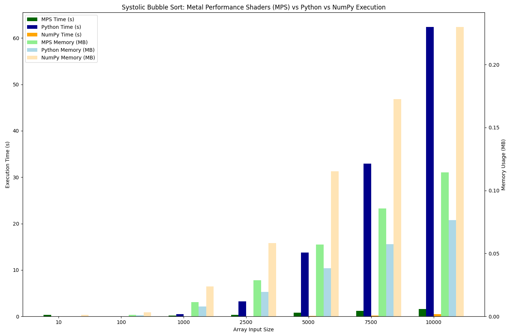

# Sorting on a Systolic Array

## Overview

Bubble sort is known for being straightforward to understand, but relatively inefficient in execution time. Applying the basic logic of bubble sort to a [systolic array](https://en.wikipedia.org/wiki/Systolic_array) provides an interesting way to test the impact of workload parallelization.

Standard bubble sort has a Big O runtime of O(n^2). Using a 1-dimensional systolic array with parallel pairwise comparisons, we can expect a worst case runtime of O(n). As noted by ChatGPT, the number of comparisons is still O(n^2), but the reduction in execution time or cycles comes from the parallelization.

Full LLM transcripts found in [LLM_TRANSCRIPT.md](./docs/LLM_TRANSCRIPT.md).

## Implementation with PyTorch

An implementation of a 1-D systolic array using PyTorch was generated using ChatGPT. In this implementation, each processing element (PE) of the systolic array is simulated by a position in a tensor, where the tensor holds all of the elements. The sort algorithm iterates over the tensor indexes and on each iteration, makes a pairwise comparison and swap over a vector of tensor values. It alternates between comparing odd first and even first items. That is, on one iteration, it will compare items beginning with odd indexes ((1, 2), (3, 4), etc.) and on the next, it compares those beginning on even indexes ((0, 1), (2, 3), etc.). An individual iteration is comparable to a systolic pulse.

The initial implementation provided by ChatGPT used `float32` values in the tensor. This may have been fine for benchmarking that code by itself, but it became a problem later when running comparisons between different implementations of the bubble sort. As such, the code was updated to use `int32` in order to match the alternative implementations.

## NumPy and Sequential Python Implementations

To serve as a point of comparison, both a NumPy implementation following the vectorization model of the PyTorch systolic array, and a standard sequential bubble sort in pure Python were implemented with assistance from ChatGPT. Unit tests were created as well, in order to verify functional correctness.

Initially, a threaded version of the systolic array was attempted as another alternate implementation. This was ultimately not successful in being functionally correct and free of deadlocks. With more time, it may have been possible to work through the issues, but the above substitutes were deemed suitable as points of comparison.

## Program Execution and Results

The PyTorch implementation was executed using Apple's Metal Performance Shaders GPU acceleration. The PyTorch library allows this to be selected as a device in place of other options like CPU or CUDA. The NumPy and pure Python implementations were executed on the CPU.

Execution time and a best-effort measure of memory usage were measured and compared for each implementation. As it was not possible to directly measure memory usage in MPS, memory usage for the PyTorch verison was estimated based on the tensor size. For NumPy and the pure Python implementations, `tracemalloc` was used to measure peak memory usage within the Python code.

Each program was run on arrays of random numbers, with the overall length of arrays increasing in size from 10 to 10000. The following results were found:

```sh
(venv) ➜  challenge-17 git:(main) ✗ python main.py
Starting benchmark...

Running for size: 10
  MPS: 0.315651s, ~0.000 MB (est)
  Python: 0.000026s, 0.000 MB (actual)
  NumPy: 0.000321s, 0.001 MB (actual)

Running for size: 100
  MPS: 0.035995s, ~0.001 MB (est)
  Python: 0.000270s, 0.001 MB (actual)
  NumPy: 0.000931s, 0.003 MB (actual)

Running for size: 1000
  MPS: 0.164218s, ~0.011 MB (est)
  Python: 0.516384s, 0.008 MB (actual)
  NumPy: 0.012091s, 0.024 MB (actual)

Running for size: 2500
  MPS: 0.342374s, ~0.029 MB (est)
  Python: 3.236944s, 0.019 MB (actual)
  NumPy: 0.039871s, 0.058 MB (actual)

Running for size: 5000
  MPS: 0.794238s, ~0.057 MB (est)
  Python: 13.757728s, 0.038 MB (actual)
  NumPy: 0.104072s, 0.115 MB (actual)

Running for size: 7500
  MPS: 1.174017s, ~0.086 MB (est)
  Python: 32.928045s, 0.057 MB (actual)
  NumPy: 0.205220s, 0.173 MB (actual)

Running for size: 10000
  MPS: 1.574206s, ~0.114 MB (est)
  Python: 62.373392s, 0.077 MB (actual)
  NumPy: 0.503727s, 0.230 MB (actual)
```

  
*Bar chart showing execution time and memory usage for PyTorch on MPS, pure sequential Python, and NumPy.*

The pure sequential Python showed the expected approximation of O(n^2) execution time growth, with execution time roughly doubling across arrays increasing in length by 2500. The two parallelized implementations - the systolic array using PyTorch and NumPy using vectorization - both show significantly lower growth in execution time. The NumPy version is the most performant in terms of execution time. This is likely due to the data transfer penalty incurred by the transfer to the GPU in the PyTorch MPS implementation.

The memory usage is somewhat more difficult to compare with certainty, due to the measurement tooling limitations noted above. However, it is interesting to note that the `tracemalloc` measurements show significantly more memory usage for the NumPy version than the pure Python sequential version. As noted by ChatGPT, this is likely due to the Python version modifying the array in-place, while the NumPy version created temporary copies. And due to `tracemalloc`'s limitations in tracking lower-level language memory usage, the NumPy implementation's peak memory estimate is likely lower than the real usage.

Future work could involve creating a working threaded version using pure Python. Though the NumPy version serves as an interesting way to compare parallelized versions, a threaded version would provide a comparison that would not involve reliance on NumPy's delegation to lower-level programming languages like C, C++, and Fortran. Another option for future work would be to implement this in hardware using SystemVerilog. Some additional code has been created to support that work, but additional analysis remains before a comparison is possible.

### ChatGPT Interpretation Highlights

ChatGPT was consulted as well during interpretation of results. Some main points from this consultation are included below for reference.

Execution Time
- Python time increases super-linearly, consistent with O(n²) behavior.
- MPS time increases much more slowly — this supports your theory that the systolic-style implementation with Metal performs better (though it's still more than linear).
- MPS becomes significantly faster at 1000+ elements — it's ~40x faster than Python at 10,000 elements.

Memory Usage
- Both stay low overall, scaling linearly with input size, which is expected.
- MPS memory is a rough estimate (based on 12 × n float bytes).
- Python memory is very efficient due to native list usage — though tracemalloc may under-report memory used by internal structures (e.g., temporaries).

NumPy Memory Usage
- The NumPy implementation uses more temporary values than the Python version, which modifies the array in-place, resulting in higher memory usage.
- `tracemalloc` does not capture memory allocated inside native C extensions, the peak memory reported for the Python version is probably fairly accurate, and the useage for the NumPy version is probably underreporting usage
