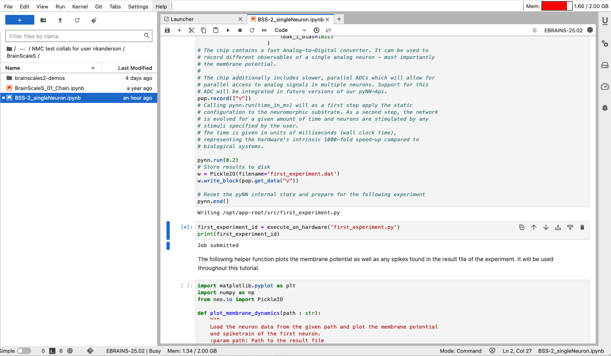
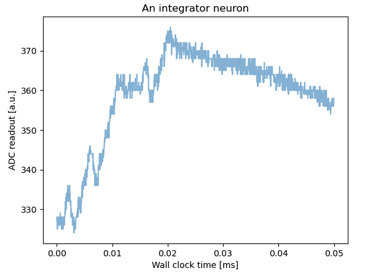
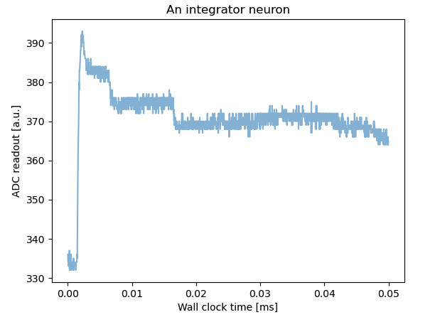
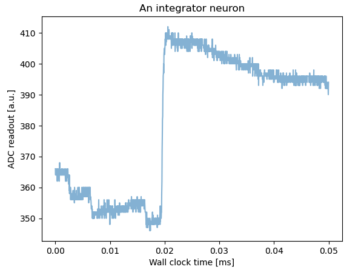
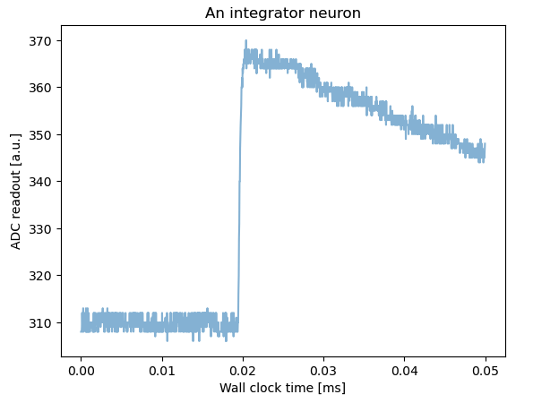
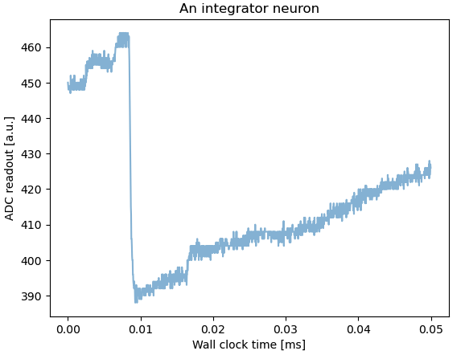

# Neuromorphic Computing on EBRAINS BrainScaleS Hardware

**Niklas Anderson**  
**May 2025**

## Single Neuron Example

Used kernel EBRAINS-25.02 to fun a single neuron example Jupyter notebook. Included 4 experiments, through only the first could be partially completed due to what seemed to be a backing hardware issue. Scripts were supposed to be sent to a local cluster for execution on a neuromorphic chip using the `execute_on_hardware` function, but failed to complete.

### Experiment One

From the Jupyter notebook description, this experiment "will record the membrane of a single, silent neuron on the analog substrate".

- Uses `pynn_brainscales.brainscales2`
- Comments in code indicate "The pyNN-interface can be used similarly to existing simulators and other neuromorphic platforms".
- Code from experiment one, describing how different objects are configured and the APIs exposed:
```python
# In the current state, we only expose the neuron type 'HXNeuron',
# which allows low-level access to all circuit parameters. It can be
# configured by passing initial values to the respective Population.
# Each population may consist of multiple neurons (in this case: one),
# all sharing the same parameters.
# Circuit parameters control the dynamic behaviour of the neuron as well as
# static configuration. Most of them are either boolean or given in units of
# 'LSB' for chip-internal Digital-to-Analog converters - they have no direct
# biological translation.
# For this first example, you may alter the leak potential and observe
# the response of the analog neuron's resting potential.
pop = pynn.Population(1, pynn.cells.HXNeuron(
                          # Leak potential, range: 300-1000
                          leak_v_leak=700,
                          # Leak conductance, range: 0-1022
                          leak_i_bias=1022)
                      )
```
  - All neurons in a population share the same parameters
  - The neuron type `HXNeuron` is in use in this example
  - Circuit parameters control dynamic behavior
- "The chip contains a fast Analog-to-Digital converter. It can be used to record different observables of a single analog neuron - most importantly the membrane potential."
- "The chip additionally includes slower, parallel ADCs which will allow for parallel access to analog signals in multiple neurons. Support for this ADC will be integrated in future versions of our pyNN-Api"
- "Calling `pynn.run(time_in_ms)` will as a first step apply the static configuration to the neuromorphic substrate. As a second step, the network is evolved for a given amount of time and neurons are stimulated by any stimuli specified by the user."
- A .dat file is written with the experiment configuration, which is then sent to the hardware.

Submitted the job to run on hardware using the `execute_on_hardware` function. Did not ever seem to complete. Looked for the job status in the job manager, but could only see what looked to be the Jupyter cells just prior to the cell calling `execute_on_hardware`.

  
*Process hanging at execution on hardware stage.*

## Basic Matrix Multiplication

Running demo found at `~/BrainScaleS/brainscales2-demos/tp_00-introduction.ipynb`, "Introduction to matrix multiplication".

Overview of functionality:
> To multiply a vector with a matrix, the matrix is configured as synapse weights. The vector is encoded as pulse widths which stimulate synapse rows, therefore each synapse multiplies its weight with a vector entry. Neurons accumulate synaptic inputs from their column, thus accumulate the multiplication results from a matrix column.

Main code for configuration of spike times and weights, and running example (plotting code has been removed):
```python
def generate_external_inputs(stimulated_population):
    """
    Create off-chip populations serving as excitatory/inhibitory spike sources.

    Feel free to modify the `{exc,inh}_spiketimes` and the `weight` of the stimulation.

    :param simulated_population: Population to map inputs to.
    """
    exc_spiketimes = [1, 3, 4, 5, 7, 8, 9, 10, 15, 17, 18, 19]  # us
    exc_spiketimes = np.array(exc_spiketimes) / 1e3
    exc_stim_pop = pynn.Population(1, SpikeSourceArray(spike_times=exc_spiketimes))
    pynn.Projection(exc_stim_pop, stimulated_p,
                    pynn.AllToAllConnector(),
                    synapse_type=StaticSynapse(weight=63),
                    receptor_type="excitatory")

    inh_spiketimes = [2, 6, 16]  # us (bio: ms)
    inh_spiketimes = np.array(inh_spiketimes) / 1e3
    inh_stim_pop = pynn.Population(1, SpikeSourceArray(spike_times=inh_spiketimes))
    pynn.Projection(inh_stim_pop, stimulated_p,
                    pynn.AllToAllConnector(),
                    synapse_type=StaticSynapse(weight=-3),
                    receptor_type="inhibitory")

# reset membrane potential before beginning of experiment (it floats otherwise)
pynn.setup(initial_config=calib)

# use calibrated parameters for neuron
silent_p = pynn.Population(2, pynn.cells.HXNeuron())
stimulated_p = pynn.Population(1, pynn.cells.HXNeuron())
generate_external_inputs(stimulated_p)
stimulated_p.record(["v", "spikes"])

pynn.run(50e-3)  # run for 50 us
```

  
*Plot using the default excitatory and inhibitory spike sources and weights.*

  
*Plot using a reduced excitatory set of spikes. Shows decreased time to excitatory spiking.*

  
*Plot using a greater magnitude excitatory set of spikes. Shows increased time to excitatory spiking.*

  
*Plot using a greater magnitude excitatory set of spikes with a small inhibitory weight (-1). Shows flattened inhibitory period prior to excitatory spiking.*

  
*Plot using a greater magnitude inhibitory spikes and reduced exhibitory spikes, with equal weights. Shows impact of inhibitory spikes over a longer period of time.*

The notebook explanation notes that there is random drift after all inputs are received, which would be reduced in typical usage where vector entries would be sent at a higher rate of up to 125 MHz.

The basic manipulations above show how a integrator neuron responds to different inputs on the excitatory and inhibitory synapses, allowing for signed values in matrix multiplication. The adjustment of weights also shows how the synapse weights impact the overall behavior of the neuron.

## Results and Conclusion

It was interesting to see some small examples, including how the pyNN library may be used to abstract the specific neurmorphic platform on which the example code is run. The matrix multiplication example ran without issue, though it was unclear if this code was running on neuromorphic hardware or not. It seems possible this code was run using `pynn_brainscales.brainscales2` to produce neuromorphic models executed on a standard CPU. It was helpful to view the changes in membrane potential that resulted from small changes to the spike values and weights.

The single neuron example never completed. It seems possible the backing service was not currently running, but there was no explicit timeout. Reviewing the code still provided some insight into how the software API for neuromorphic hardware was designed.

It would be interesting to revisit the single neuron example if it could be run on the neuromorphic chip successfully. Also, the demos seemed well-designed, with both conceptual explanations and concrete coding examples. With more time, stepping through more of the tutorials from the [BrainScaleS-2 Demos & Examples](https://electronicvisions.github.io/documentation-brainscales2/latest/brainscales2-demos/index.html) site would be helpful in understanding the neuromorphic principles and implementation.
