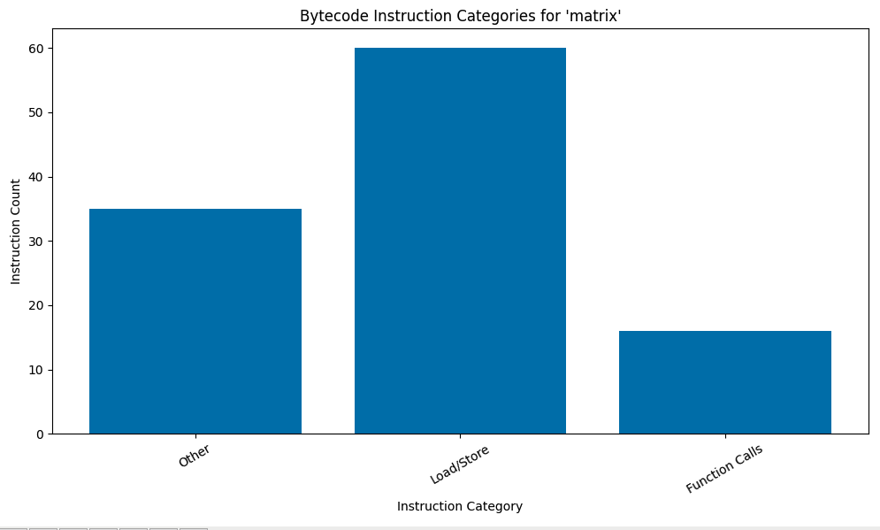
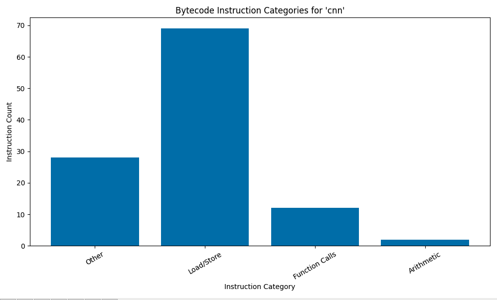
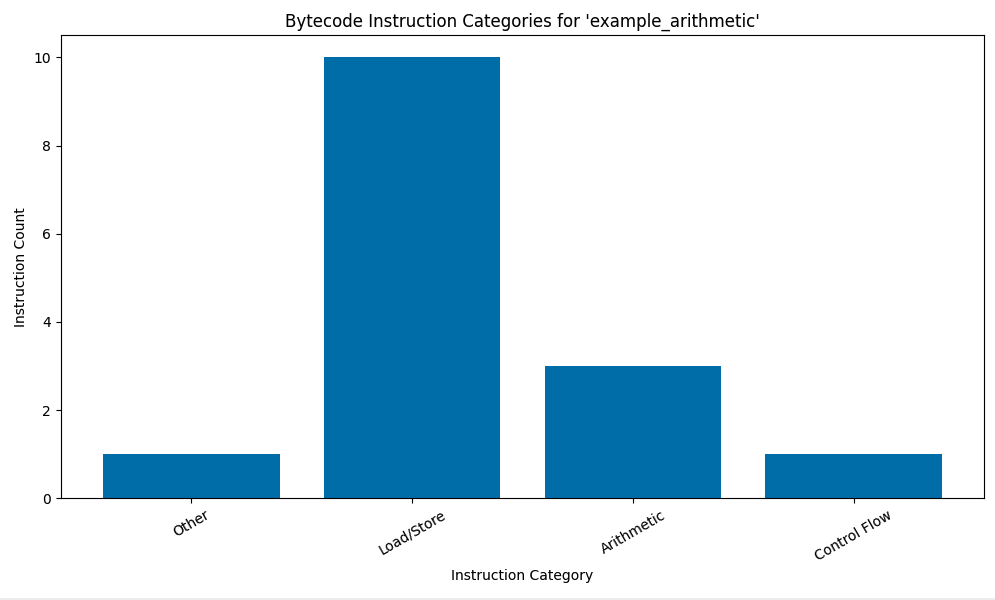

# Python Bytecode Analysis

Challenge 5 from [w1_codefest.pdf](./w1_codefest.pdf), involving bytecode analysis of various Python programs with the goal of identifying parallelism or other opportunities for optimizations through alternate hardware or instruction set usage.

Full LLM transcripts found in [LLM_TRANSCRIPT.md](./LLM_TRANSCRIPT.md).

## Results

Generated bar charts showing instructions by category for each program showed no or very few arithmetic instructions for each program. ChatGPT suggested this was due to the programs delegating all arithmetic functionality to underlying C programs. This would make sense, but doesn't help much with analysis.


*Bar chart of opcodes by category for matrix multiplication program, indicating that arithmetic functions are not in Python, and have likely been delegated to C code via Numpy instead.*


*Bar chart of opcodes by category for CNN program*


*Bar chart of opcodes by category for example program, showing that basic arithmetic functions in Python should be captured.*

## Commands

The commands `run` and `analyze` may be called with any of the following shorthand program names: `od`, `cnn`, `matrix`, `qs`, or `crypt`.

Run unit tests for a program:
```sh
python main.py qs run
```

Analyze a program:
```sh
python main.py qs analyze
```

Generate a bar chart showing instructions by category:
```sh
python main.py qs analyze-bytecode
```

Generate an example bar chart with arithmetic instructions:
```sh
python main.py dummy test-bytecode example_arithmetic
```

May substitute `example_control_flow`, `example_function_calls`, or `example_load_store` in place of `example_arithmetic`.
