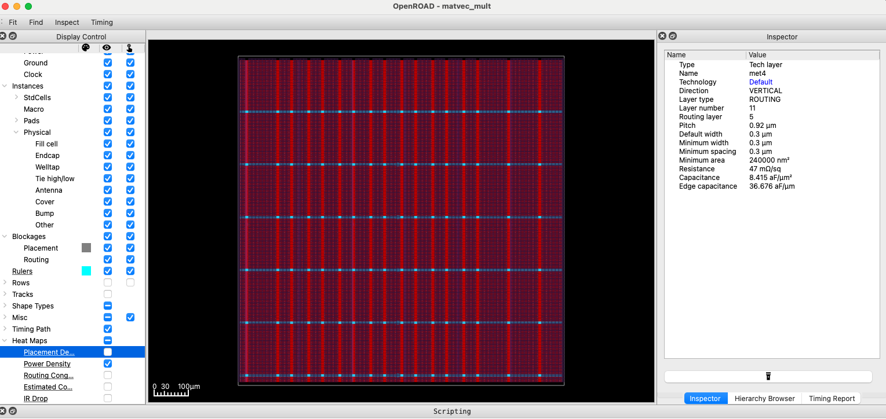
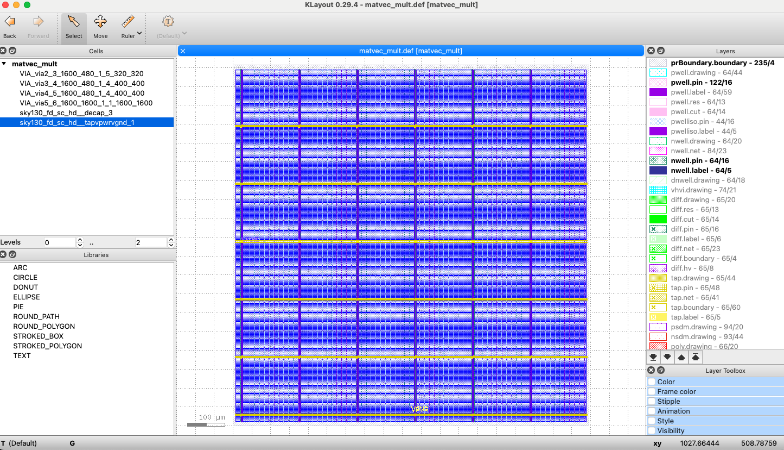

# LSTM Autoencoder Hardware Acceleration v0.2.0

## Overview

This work represents the iterative changes outlined in [Challenge 23](../challenge-23/README.md).

## Summary of Work

### Updated Profiling

After fixing the weight loading transposition issue (see [CHANGELOG](./docs/CHANGELOG.md)), the overall runtime for inference was much longer, going from ~2s to ~60s. The identified bottlenecks were the same, however, so at this point, it does not seem like changing hardware acceleration targets is necessary. It may be worthwhile to profile on multiple machines and attempt to confirm the updated runtime though, as it will impact the ultimate assessment of hardware execution speedup.

### Reduced Precision Values

With assistance from ChatGPT for analysis of existing inference and weights, determined the following fixed point formats should suffice:

| Signal Type      | Max abs | Recommended Q-format | Notes                                  |
| ---------------- | ------- | -------------------- | -------------------------------------- |
| `matvec_mul`     | ±3.3    | `Q4.12`              | Range: ±8.0, resolution ≈ 0.00024      |
| `sigmoid input`  | ±4.2    | `Q4.12`              | Same                                   |
| `sigmoid output` | \[0, 1] | `U1.15`              | Unsigned                               |
| `tanh input`     | ±8      | `Q5.11` or `Q6.10`   | Slightly wider range needed            |
| `tanh output`    | ±1      | `Q2.14`              | Very precise near 0; saturates near ±1 |

Weights: `Q2.14`
Biases: also `Q2.14`

Since our matrix-vector multiply consistently works on weights (either `W` or `U`) and an input vector (which should have the format `Q4.12`), it should be made to work specifically with those formats. ChatGPT suggests the following approach:

1. Multiply one weight element (Q2.14) × one vector element (Q4.12):
  - Total fractional bits: 14 + 12 = 26
  - Bit width: 16b × 16b → 32b product
  - Result format: Q6.26

2. Sum across dot product:
  - You accumulate many Q6.26 values
  - Accumulator might be, say, 40–48 bits to preserve full precision

3. Truncate/round the final sum to Q4.12 (or Q5.11, Q6.10 depending on dynamic range)

### Time-Multilplexed Matrix-Vector Multiplier in SV

TODO:
- Will want to flatten the 2D input ports prior to synthesis. It should have flattened wires or packed arrays for all inputs and outputs.
- In simulation, the shared memory (sram) can be a logic signed [15:0] sram[0:4095] array instantiated in the testbench and passed by reference to both matrix_loader and matvec_tm_multiplier.
  - In synthesis, we'll eventually replace this with a dual-port SRAM macro (e.g., sky130_sram_1rw1r_32x1024_8) and mux the address/data paths between reader and writer. (Though I'm not sure we'll need a writer, so this part may be simplified.)

### OpenLane2 Synthesis

#### Mac4 Testing

Synthesized the mac4 SystemVerilog by first generating verilog code using the sv2v CLI tool, then creating a minimal `config.json` file. Results from initial synthesis indicate timing closure was achieved with a clock period of 40ns for this combinational circuit, resulting in a max clock frequency of 25MHz. In intepreting the `metrics.json output`, ChatGPT noted the critical path was around 26ns. It seems like it would be possible to optimize the design to get closer to a 26ns clock period, but may take significant time configuring settings.

ChatGPT noted the following metrics to review from the `metrics.json` in order to interpret timing data:
- `timing__setup_ws` - worst-case setup path delay, which should be close to the actual critical path
- Timing violations:
  - `timing__setup_vio__count`
  - `timing__hold_vio__count`
  - `timing__setup_wns`
  - `timing__tns`

There may also be design rule violations, related to max slew constraints.

In order to consider alternate design options, a smaller mac2 variant was created and synthesized using OpenLane2. Clock speed improvements were marginal, with a minimum period somewhere around 30ns. It seems unlikely this approach is worth pursuing, but it may be worth considering if many mac instances may be used in parallel in the matvec_mul module.

#### Conversion to Verilog

The tool [sv2v](https://github.com/zachjs/sv2v) was used to convert the SystemVerilog designs to Verilog, which is necessary for use with OpenLane2. The following command was used:

```sh
sv2v --write=adjacent --define=USE_SRAM_MACRO matrix_loader.sv mac4.sv matvec_mult.sv
```

#### Troubleshooting Synthesis

```sh
yosys -p 'read_verilog -sv -D SYNTHESIS -D USE_POWER_PINS src/*.v; hierarchy -top matvec_mult_top; proc; flatten; opt; check'
```

#### Interpreting Synthesis Results

Assistance with interpreting synthesis results was requested from ChatGPT, given the lack of familiarity with the OpenLane toolchain and the related metrics. ChatGPT provided the following analysis of the `metrics.json` from the synthesis run on the `matvec_mul` module using the `config-matvec_mult.json` file with a clock period of 40ns.

- Confirmed timing closure was met with the configured clock period (40ns).
- From the `"power__total": 0.00157694763` value, determined that the total power is 1.58mW at 1.8V under typical conditions.
  - ChatGPT described this as efficient, and provided the comparison to an ARM Cortex-M0 "which might use ~10-15mW at 50MHz for simple tasks".
- Stated that the die area is ~0.234 mm^2 with utilization around 50.2%, based on values for `design__die__area` (234460), `design__core__area` (218865), and `design__instance__utilization` (0.502092)
  - Compared this to commerical SoCs ranging from 1mm^2 to 100+mm^2, putting this in the embedded / micrcontroller scale
- Determined the average standard cell consisted of 4-10 transistors, with total transistors ranging from 67K to 167K, based on `"design__instance__count__stdcell": 16740`
  - Contextualized this as being less than a RISC-V core, but greater than a 6502 CPU, and noted the number was "consistent with a specialized accelerator or control logic"
- Noted zero errors across a number of metrics, though did not contextualize this further
  - Noted metrics with zero errors included `timing__setup_vio__count`, `timing__hold_vio__count`, `magic__drc_error__count`, `design__lvs_error__count`, `design__xor_difference__count`. Aside from the previously discussed timing closure, the implications of these metrics having zero errors needs further investigation to contribute meaningfully to analysis.

#### Commands and Visuals

The following opens the openroad GUI:
```sh
openlane --last-run --flow openinopenroad config-matvec_mult.json
```

Example of loading a .def file:
```
read_def runs/RUN_2025-06-05_08-12-22/final/def/matvec_mult.def
```
The above shows the relative path if the GUI was opened from the `verilog` directory, or wherever `openlane` synthesis was run from.

Got the following results from running tcl commands in the openroad GUI:
```tcl
>>> report_cell_usage
Cell type report:                       Count       Area
  Fill cell                               686    2574.97
  Tap cell                              12420   15539.90
  Standard cell                         25958  262271.54
  Total                                 39064  280386.4

```

The following command opens the KLayout viewer:
```sh
openlane --last-run --flow openinklayout config-matvec_mult.json
```

Unfortunately, ChatGPT had a poor understand of what commands to run in order to view anything of interest. The [OpenLane2 Newcomers documentation](https://openlane2.readthedocs.io/en/latest/getting_started/newcomers/index.html) provided the basic commands to open the GUIs, as shown above, but could not provide much support in investigation of this specific design. With more time, it would be interesting to dive into the docs for these GUIs and better understand how they work.

Potentially the most helpful insight from ChatGPT may be its suggestion that the layout looks fairly homegeneous because there are no macros and the design is highly uniform. However, it does not explain why it was not possible to view the individual MAC4 instance, for example, and this suggested analysis should be grounded in further exploration of alternative designs.

  
*Power density as visualized in the Openroad GUI.*

  
*Basic visualization in the KLayout GUI.*

## Future Work

### Controller for Multiple Layers, Gates, and Weights

In order to specify the specific weights to use for a given matrix-vector multiplication option, we will need to allow for a control word to be passed, along with the vector input. The control word should have enough bits to select the appropriate layer (4 options), gate (4 options), and weight (`W` or `U`), as well as one additional option to select the dense layer. This will require 6 bits in order to cover 32 combinations for the main encoder and decoder layers and their gates and weights, plus 1 for the dense layer, or 33 total. There will essentially be a "dense" bit.

Another alternative is to use a basic FSM to select the appriopriate combination from the above in the order called by the algorithm. This may be the simplest next step before implementing a control word. The FSM could be implemented within the SRAM memory controller for loading the weights.

### SRAM Addressing

One possible option would be to organize all matrices (`W` and `U`, may include `b` vector here as well for future usage) for all layers and gates in a single flat memory using multiple SRAM macros to create logical banks. For simplicity, it may be easiest to initially base each layer size on the largest required layer size, which should be one of the layers with a hidden size of 64.

The memory address offset for a given layer, gate, and weight will be calculated in the following manner:
```
offset = BASE 
       + LAYER_ID * LAYER_STRIDE 
       + GATE_ID * GATE_STRIDE 
       + MATRIX_ID * MATRIX_STRIDE;
```

LAYER_STRIDE = Max total layer size = space for 4 gates × 3 matrices (W, U, b) = 12 matrix slots of varying size
GATE_STRIDE = 3 matrices - TODO: It may be possible to have a base value and scale it depending on the particular layer
MATRIX_STRIDE = rows × cols - Determined by the client code

This is not the most space-efficient, but could be a relatively simple inital organization.
